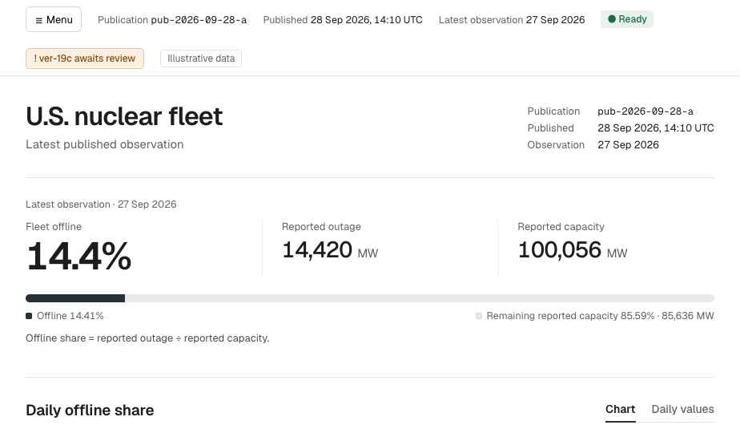
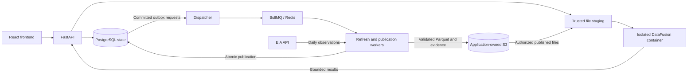

<p align="center">
  
</p>

# Trinity

**Explore U.S. nuclear outages. Trace every result to a validated data version.**

Trinity turns the U.S. Energy Information Administration's daily nuclear outage data into a role-aware dashboard, dataset browser, and read-only SQL workspace. It stores validated Parquet datasets in application-owned S3 storage, so exploration does not make live requests to EIA.

Built for the **Arkham Outage Explorer** engineering challenge.

[Run locally](#run-locally) · [Architecture](#architecture) · [Data and findings](#data-and-findings) · [SQL](#try-a-query) · [Verification](#verification) · [Documentation](#documentation)

## What you can do

- **Follow the national fleet.** View daily outage trends, same-day capacity, calculated offline share, and the underlying table values.
- **Explore three levels of detail.** Browse national, facility, and generator datasets with date filters and publication-bound pagination.
- **Ask questions in SQL.** Run a supported single-table `SELECT` against published data in an isolated DataFusion container.
- **Refresh without replacing usable data too early.** Track scheduled or manual refreshes while readers keep using the last valid publication.
- **Review the evidence.** Inspect validation results, approve candidates with review warnings, and recover eligible failed work without erasing history.

### Three roles, enforced by the API

| Account | Access |
|---|---|
| `viewer` | National dashboard, trends, and daily values. No facility/generator detail or SQL workspace. |
| `analyst` | Dashboard, all three datasets, filtered previews, and permitted read-only SQL. |
| `admin` | Analyst access plus initial shared setup, schedule settings, refreshes, candidate review, and recovery actions. |

Accounts are provisioned locally with passwords you choose. There are no bundled passwords or external identity-provider requirements. Hiding a control in the interface does not replace server-side authorization.

<details>
<summary><strong>View the dashboard design reference</strong></summary>

This is the supplied design reference with illustrative values, not a screenshot of the running application. Visual acceptance remains in progress.



See the [reference provenance](docs/design-reference/2026-10-04-explorer-handoff/PROVENANCE.md) and [design authorship record](NOTES.md#figma-mockups-brand-and-claude-handoff--october-4-2026).

</details>

## Run locally

The local application uses Docker Compose for the backend and Vite for the frontend. **The base setup starts login and the application shell; real-data exploration also needs the query runtime, S3 configuration, and a published dataset in step 3.**

### Prerequisites

| Tool or service | Required for |
|---|---|
| Git and repository access | Clone the source. |
| Docker with Compose | PostgreSQL, the API, background workers, and isolated query containers. The recorded local setup used Docker 29.8.1 / Compose 5.5.1 on macOS arm64. |
| Node.js **24.21.0** and npm | Frontend installation and development; pinned in `frontend/.nvmrc`. |
| CPython **3.14.8** and uv **0.12.23** | Native backend development and tests. The API Docker image includes its own Python environment. |
| EIA API key and private AWS S3 storage | Fetch and publish real data. Existing published data can be queried without contacting EIA. |

Dependency locks are committed in `backend/uv.lock` and `frontend/package-lock.json`.

### 1. Start the API and create the local accounts

```sh
git clone https://github.com/alejandroayalad/trinity.git
cd trinity
```

From the repository root, enter a local PostgreSQL password. This prompt syntax is for **zsh**:

```zsh
read -rs 'TRINITY_POSTGRES_PASSWORD?Local PostgreSQL password: '
export TRINITY_POSTGRES_PASSWORD
docker compose up -d --build --wait
docker compose run --rm api alembic upgrade head
docker compose run --rm api python -m trinity.auth.seed
```

The seed command asks privately for `viewer`, `analyst`, and `admin` passwords of 15–1024 characters. Rerunning it preserves existing accounts and passwords. Reuse the original database password when restarting an existing installation.

Check liveness and open the implemented API documentation:

```sh
curl --fail --silent --show-error http://127.0.0.1:8000/health
```

Expected: `{"status":"ok"}`. API docs: <http://127.0.0.1:8000/docs>. Health reports process liveness, not database or data readiness. The API listens on `127.0.0.1:8000`; PostgreSQL is on `127.0.0.1:15432`.

### 2. Start the frontend

In a second terminal, from the repository root:

```sh
cd frontend
npm ci
npm run dev
```

Open <http://127.0.0.1:5173> and use one of your provisioned accounts. Vite proxies `/api` to the local backend. No EIA key or AWS credential belongs in frontend configuration.

Before the first publication, Viewer and Analyst see the waiting state. Admin completes shared setup once. Keep the schedule disabled until the workers and storage are configured; saving setup does not itself publish data.

### 3. Enable real-data exploration and refresh

The base Compose file does not enable analytical execution. The complete local stack adds [`compose.sql.yaml`](compose.sql.yaml) and the `workers` profile.

Build the query image from this checkout and use its immutable image ID:

```sh
docker build -f backend/Dockerfile.query -t trinity-query:local backend
export TRINITY_QUERY_IMAGE="$(docker image inspect trinity-query:local --format '{{.Id}}')"
```

Configure these values in your private operator environment before starting the full stack:

| Configuration | What to supply |
|---|---|
| `TRINITY_POSTGRES_PASSWORD`, `EIA_API_KEY` | The original local database password and your EIA key, delivered through Compose secrets. [EIA configuration](backend/README.md#eia-configuration). |
| `TRINITY_S3_BUCKET`, `TRINITY_S3_PREFIX`, `TRINITY_S3_REGION` | An existing private storage location with verified conditional-write and retention protection. [Storage requirements](backend/README.md#immutable-storage-library--step-4). |
| Worker AWS profile | The supplied Compose file uses `trinity-writer` from the host's `~/.aws`. Configure that profile with access to your storage. |
| `TRINITY_QUERY_AWS_DIRECTORY`, `TRINITY_QUERY_READ_PROFILE` | An absolute path to an existing AWS profile directory and its published-data read profile. Compose mounts its `config`/`credentials` location read-only and its `login/` cache separately. |
| `TRINITY_QUERY_DEPLOYMENT_ID`, `TRINITY_QUERY_STAGE_VOLUME` | A stable UUID and dedicated staging-volume name. Preserve both across restarts. |
| `TRINITY_DOCKER_SOCKET_HOST`, `TRINITY_DOCKER_GID` | Your Docker daemon's Unix socket path and actual group ID. The trusted API uses them to launch isolated queries. |
| `TRINITY_PREVIEW_ENABLED` | Exactly `true` to enable Dashboard, previews, and entity choices. |
| Cursor signing keys | Separate Preview and Refresh key rings, as described below. These authenticate pagination bookmarks. |

<details>
<summary>Cursor-key configuration</summary>

Set `TRINITY_PREVIEW_CURSOR_KEYS_JSON` and `TRINITY_REFRESH_CURSOR_KEYS_JSON` to separate JSON objects mapping a key ID to an unpadded base64url encoding of 32 random bytes. Set `TRINITY_PREVIEW_CURSOR_ACTIVE_KEY_ID` and `TRINITY_REFRESH_CURSOR_ACTIVE_KEY_ID` to the corresponding IDs.

Example shape only: `{"local-v1":"<43-character base64url key>"}` with active ID `local-v1`. Use independently generated keys, not this placeholder. Keep them in private configuration and reuse them across restarts; the application does not generate them at startup. See the [Preview cursor design](sdd/dataset-preview/design.md) and [Refresh configuration](backend/README.md#refresh-dispatch-and-preparation--tasks-24).

</details>

The Python application reads process environment variables; it does not automatically load an `.env` file. Compose can use the root `.env` for interpolation. Keep private configuration out of Git. See [query-runtime setup](backend/SQL.md#configure-the-local-services) for the mount and recovery details.

With the configuration complete, run from the repository root in the configured terminal:

```sh
docker compose -f compose.yaml -f compose.sql.yaml --profile workers config --quiet
docker compose -f compose.yaml -f compose.sql.yaml build api
docker compose -f compose.yaml -f compose.sql.yaml --profile workers up -d --wait
```

The migration and account-seeding steps above must already be complete. Use one worker host and one publication consumer. The query image must match the API's runtime protocol.

Sign in as `admin`, finish shared setup if needed, then open **Refresh → Start refresh**. A refresh retrieves EIA data and writes to your configured S3 storage. Follow the run to publication; review warnings require Admin approval, while required validation failures block publication. Once published, sign in as Viewer or Analyst to explore it.

**Local deployment limits:** the supplied Compose configuration mounts the host AWS profile directory into storage workers and gives the trusted API Docker access. The recorded local read profile can also write; a separate read-only role and stronger secret delivery remain open for shared deployment. Public hosting is not configured. A clean-checkout rehearsal of this full sequence is still pending.

To stop the complete stack while retaining its named volumes:

```sh
docker compose -f compose.yaml -f compose.sql.yaml --profile workers down
```

For the base setup alone, use `docker compose down`. Do not add `-v` if you want to retain local state and evidence. See [troubleshooting](#troubleshooting) for first-run failures.

## Architecture

**PostgreSQL owns application state. DataFusion queries outage data in Parquet.** The application does not copy outage rows into PostgreSQL for user SQL.



| Part | Responsibility |
|---|---|
| React, TypeScript, Vite | Role-aware pages, filters, SQL editor, refresh progress, and settings. |
| Python, FastAPI, Psycopg, Alembic | Sessions, authorization, HTTP contracts, explicit state transactions, and migrations. |
| EIA connector and PyArrow | Bounded retrieval, exact decimal parsing, typed Parquet, and saved-file validation. |
| S3 | Immutable versions, manifests, sanitized source evidence, and validation evidence. |
| BullMQ and Redis | Background delivery; the PostgreSQL outbox preserves committed dispatch obligations. |
| SQLGlot and DataFusion | Restricted SQL validation followed by analytical execution over permitted published files. |

### How data becomes visible

1. An Admin action or the daily scheduler records a refresh and its outbox request in one database transaction.
2. Workers fetch all three EIA routes for one fixed window, prepare Parquet, and validate the exact saved files.
3. A complete candidate with no review warnings proceeds automatically. Review warnings require approval tied to that candidate's evidence. Failed or incomplete required checks cannot be approved away.
4. Publication verifies the candidate and changes the active version atomically. Each analytical request stays on the publication it captured.

If EIA retrieval or validation fails, the previous publication stays available. Before the first successful publication, the application reports data unavailable. One refresh lifecycle is admitted at a time, including pending review and unresolved failures.

**Tradeoffs:** separate state and analytical storage avoids a second outage database, but requires coordinated publication and file verification. Per-query containers isolate execution at the cost of startup overhead. Publication crash recovery requires an operator under the current one-host design. See [architecture](docs/backend.md), [security](docs/security-contract.md), and [decisions](DECISIONS.md) for the contracts and rationale.

## Data and findings

The source is the [EIA Open Data API](https://www.eia.gov/opendata/). Trinity's supported history starts at **2024-10-02**. Each refresh re-fetches that window through the latest national observation date to capture source revisions.

| Analytical table | One row represents | Daily key |
|---|---|---|
| `national_outages` | The U.S. fleet on one date | `period` |
| `facility_outages` | One facility on one date | `period`, `facility` |
| `generator_outages` | One generator within a facility on one date | `period`, `facility`, `generator` |

Capacity and outage are stored as `DECIMAL(24,6)` in **MW**, not MWh. Identifiers remain strings. The daily calculated metric is:

```text
offline_share_percent = 100 × outage / capacity
```

Use capacity from the same day. For an aggregate within one date and dataset, sum MW before dividing; do not average percentages. Missing observations mean **not reported**, not zero outage. Zero capacity yields a null ratio. Source `percentOutage` remains separate from the calculated metric. The [schema and ER diagrams](docs/schema.md) define the complete rules.

### Three findings that shaped the implementation

| Observation | Why it matters |
|---|---|
| National reported capacity rose **2,436.2 MW** overnight with the same 55 facilities. | A fixed capacity denominator would distort offline share. The seasonal explanation remains unconfirmed. |
| Palisades entered the saved dataset already **100% offline**, with 389 consecutive fully offline records in the inspected window. | First appearance is not evidence of a new breakdown; earlier dates must not become invented zero-outage rows. |
| The facility API advertised **95 rows** but returned **55** for October 1, 2026. | Pagination must verify returned records and coverage rather than trust the advertised facility total. |

Alayala's original analysis, follow-up checks, source explanations, and scope limits are in [FINDINGS.md](FINDINGS.md). **Maintain data evidence — ongoing.**

### Reproduce the findings without credentials

From the repository root, with Python installed:

```sh
python3 scripts/generate_report.py --inputs evidence/findings/inputs --out backend/artifacts/findings
```

Choose a new output directory on every run. Expected: exit `0` and `Historical claims reproduced: True`. The command writes `REPORT.md`, `report.json`, and `reconciliation.csv` using bundled historical inputs; it makes no network requests.

The retained report covers **731 days**, reproduces **16 historical claim checks**, and records **82,650 exact MW comparisons** with zero differences. This verifies the saved-data claims, not every EIA historical page or a new publication. See the [reproduction guide](evidence/findings/README.md).

## Try a query

After a dataset is published, sign in as `analyst` or `admin` and open **SQL**:

```sql
SELECT period, capacity, outage
FROM national_outages
ORDER BY period DESC
LIMIT 30;
```

This reads the 30 most recent national observations in the active publication. Results preserve exact numeric values as decimal strings in the API.

The supported grammar includes a single-table `SELECT`, explicit columns, filters, sorting, grouping, arithmetic, searched `CASE`, and `COUNT`, `SUM`, `AVG`, `MIN`, `MAX`, `ROUND`, `COALESCE`, and `NULLIF`. Joins, CTEs, subqueries, writes, and external file/URL readers are rejected.

Default SQL bounds are **1,000 result rows**, **5 MiB per response**, **30 seconds for analytical execution including file staging**, and **1 GiB per query container**. Shared admission allows two active analytical requests per user and four deployment-wide. The container has no network, credentials, or Docker socket; it receives only authorized published Parquet files mounted read-only. See the [SQL contract](sdd/single-table-sql/spec.md) and [security limits](docs/security-contract.md).

## Verification

### Run the local checks

Frontend, from `frontend/`:

```sh
npm run typecheck
npm run lint
npm test
npm run build
```

Backend, from `backend/`, with the pinned Python and uv versions:

```sh
uv sync --locked
uv run --locked python -m unittest discover -s tests -v
```

The default backend run skips opt-in service tests when their configuration is absent. Use the dedicated runners for [PostgreSQL/authentication](backend/README.md#run-authentication-and-catalog-acceptance), [isolated SQL](backend/SQL.md#reproduce-local-evidence), [refresh/publication](backend/README.md#refresh-dispatch-and-preparation--tasks-24), and [browser acceptance](frontend/README.md#verify). They require the documented local services and use disposable fixtures; skipped checks are not passes.

### Recorded delivery evidence — October 6, 2026

| Check | Recorded result |
|---|---|
| Frontend typecheck, lint, and production build | Passed. |
| Frontend unit/component tests | 128 passed. |
| Browser regressions | 9 passed in Chromium with synthetic API responses. |
| Default backend suite | 571 passed; 258 opt-in tests skipped. |
| Live refresh #13 | Published the October 2, 2024–October 6, 2026 window; all 16 required checks passed. |

These are dated results from the [integration delivery record](ai/sessions/2026-10-06-frontend-main-delivery.md), not a claim that every current checkout or runtime scenario has passed. The live run took 100.67 seconds overall, including 39.95 seconds for storage; one observation is not a performance guarantee.

### Known limits and remaining acceptance

- Full visual/accessibility approval, all browser acceptance scenarios, and a clean-checkout evaluator rehearsal remain open.
- The supplied runtime and integration runners use **PostgreSQL 17.11**. [A17](DECISIONS.md#a17--dependency-versions-and-update-policy-closed) still lists **18.6**; that documented version discrepancy remains unresolved.
- Local execution is the delivery target. Public ingress, HTTPS hosting, and shared-deployment credential separation still need work.
- Publication uses one worker host and explicit operator crash reconciliation. Multi-host failover and automatic publication crash recovery are deferred.
- One shared account is in scope. Registration, multiple organizations, export, SQL autocomplete, and query history are outside v1.
- The supported data window is not the full EIA history back to 2007. Agreement across routes cannot detect an omission shared by all three.

## Troubleshooting

| Symptom | Check |
|---|---|
| Health succeeds, but login returns `auth_unavailable` | Apply migrations, seed the accounts, and confirm the original database password. Health does not test authentication storage. |
| Viewer/Analyst sees the waiting screen | The installation has no active publication. Stored files or a prepared candidate alone do not publish data. |
| Dashboard or preview returns `503` | Confirm `TRINITY_PREVIEW_ENABLED=true`, cursor keys, S3/profile access, and the matching query image/socket/staging configuration. |
| Pagination returns `publication_changed` | Restart from the first page. A cursor belongs to one publication and one set of filters. |
| A new refresh is blocked | Inspect the current run, candidate review, or unresolved failure. Use its supported approval/recovery action. |
| Publication remains blocked after a crash | Follow [operator reconciliation](backend/README.md#publication-worker-and-operator-recovery); do not clear database reservations or replace evidence locks manually. |

## Repository map

```text
backend/             FastAPI application, connector, workers, query runtime, migrations, tests
frontend/            React application, unit/component tests, browser checks
docs/                Data, API, security, and architecture contracts; design references
evidence/            Saved source evidence and reproducible findings
scripts/             Findings report and diagnostic commands
sdd/                 Feature proposals, specifications, designs, and task records
ai/sessions/         Dated implementation, review, and verification history
compose.yaml         Base API/database and optional background workers
compose.sql.yaml     Query execution, staging, and recovery services
```

## Documentation

| Read this | For |
|---|---|
| [DECISIONS.md](DECISIONS.md) | Accepted choices, alternatives, tradeoffs, and unresolved topics. |
| [FINDINGS.md](FINDINGS.md) | Data analysis, anomalies, reproducible checks, and evidence limits. |
| [NOTES.md](NOTES.md) | Human/AI contributions, corrections, and verification records. |
| [PRODUCT.md](PRODUCT.md) | Selected product scope and user flows. |
| [Data contract](docs/schema.md) | Analytical schemas, application ER diagrams, metrics, and publication invariants. |
| [API contract](docs/api-contract.md) / [OpenAPI](docs/openapi.json) | HTTP operations, request/response schemas, and recovery behavior. |
| [Security contract](docs/security-contract.md) | Permissions, SQL policy, isolation, limits, and trust boundaries. |
| [Backend architecture](docs/backend.md) | Feature ownership, process boundaries, and transactions. |
| [Backend guide](backend/README.md) / [SQL runtime](backend/SQL.md) / [Frontend guide](frontend/README.md) | Component setup, commands, and focused checks. |
| [CONTRIBUTING.md](CONTRIBUTING.md) | Code readability, comment, docstring, and review conventions. |

Some component guides and session records retain dated slice-level status statements. Use the [October 6 integration record](ai/sessions/2026-10-06-frontend-main-delivery.md) for the latest recorded delivery baseline and the current contracts for behavior.

### Authorship and AI use

Alayala owns the product choices, original EIA analysis, and Figma interface mockups. The earlier brand reference was created with ChatGPT. AI-assisted implementation and later changes are recorded separately in [Engineering Notes](NOTES.md), with the canonical [design attribution](NOTES.md#figma-mockups-brand-and-claude-handoff--october-4-2026) and [Explorer package provenance](docs/design-reference/2026-10-04-explorer-handoff/PROVENANCE.md). Design examples are not EIA findings or evidence of completed visual acceptance.
