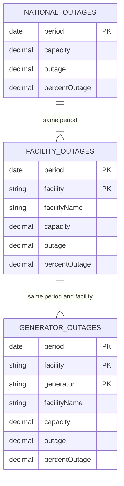
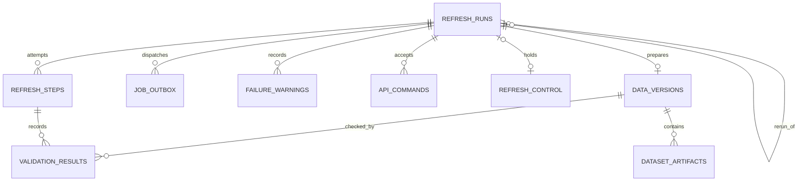
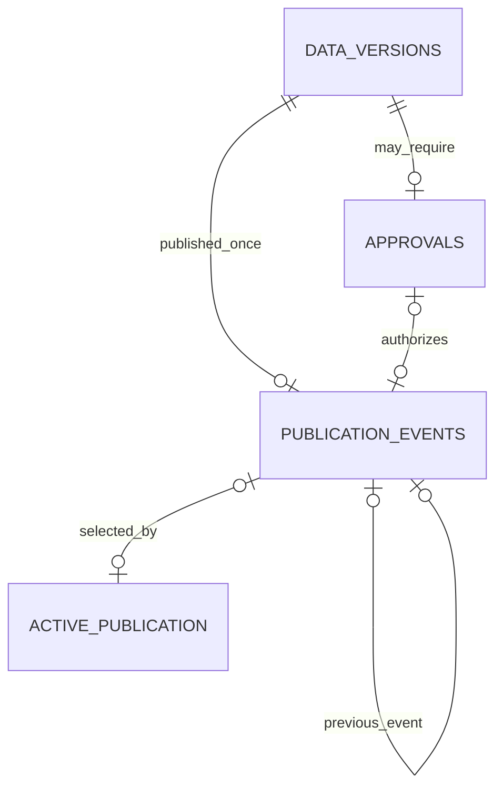

# Trinity data contract v1

Status: finalized specification, October 2, 2026 (America/Merida). Prepared by AI at alayala's request to finalize the data contract. These are implementation requirements, not implemented behavior or new runtime findings. [A9](../DECISIONS.md#a9--data-contract-v1-finalized) records the choice, alternatives, and limits. A1–A8 remain in force except where the approved [A16 workflow](../DECISIONS.md#a16--approved-api-flow-and-detailed-contract) supersedes selectable publication policy and recovery behavior. October 3 amendment: analytical fields/checks remain v1; application control fields and lifecycle below implement the approved warning-based flow. The original decisions/history remain recorded.

## 1. Boundary and data flow

Input: the three EIA API v2 nuclear-outage routes. Output: one validated, immutable version containing all three analytical datasets and a PostgreSQL record of its publication. PostgreSQL holds application state; DataFusion reads the permitted published Parquet files. Outage rows are not copied into PostgreSQL.

Flow: record refresh and outbox request together → fetch a fixed window → parse and prepare files → validate the exact manifest → publish automatically without review warnings or wait for Admin approval of frozen warnings. A manifest lists the exact files and their checksums. Required failure at any stage keeps the candidate unpublished and leaves the previous publication available. Before the first publication, analytical data is unavailable.

This document closes the logical data model and publication invariants. It does not select a language, web framework, SQL parser, allowed SQL grammar, queue tuning, or migration library. The original challenge PDF and source exports are absent from this repository; scope follows the current project documents.

## 2. Analytical datasets and keys

Names below are the canonical analytical table names. `dataset_key` in application records uses `national`, `facility`, or `generator`.

| Table | EIA route below `/v2/nuclear-outages/` | Meaning of one row | Unique key within one version |
|---|---|---|---|
| `national_outages` | `us-nuclear-outages/data/` | One national observation for one date | `period` |
| `facility_outages` | `facility-nuclear-outages/data/` | One facility observation for one date | `(period, facility)` |
| `generator_outages` | `generator-nuclear-outages/data/` | One generator within one facility for one date | `(period, facility, generator)` |

Across versions, the identifier is `(version_id, daily key)`. The same source key can have revised values in a later version. The version belongs to the artifact manifest; it is not a fabricated EIA column. No globally unique generator ID or sequential generator numbering is assumed.

| Column | Tables | Parquet logical type | Null allowed? | Meaning and parsing rule |
|---|---|---|---|---|
| `period` | All | `DATE` (Arrow `Date32`) | No | Strict `YYYY-MM-DD` calendar date. Keep the source date; do not apply a timezone conversion. |
| `facility` | Facility, generator | `STRING` | No | Source identifier. Preserve case and leading zeros. Reject empty or whitespace-only IDs; do not trim, renumber, or convert to an integer. |
| `generator` | Generator | `STRING` | No | Source identifier within its facility. Same preservation rule as `facility`. |
| `facilityName` | Facility, generator | `STRING` | Yes | Source label, preserved when provided. A missing or blank label becomes null and is recorded as a diagnostic. Never use a label as a key. |
| `capacity` | All | `DECIMAL(24,6)` | No | Reported capacity in MW. Must be finite and nonnegative. Zero remains zero. |
| `outage` | All | `DECIMAL(24,6)` | No | Reported outage in MW. Must be finite. Retain signed values; unusual ranges are diagnostic checks below. |
| `percentOutage` | All | `DECIMAL(24,6)` | Yes | Source percentage, kept separately from the calculated metric. Absent/null/blank means unknown. Nonempty invalid numeric text fails parsing. |

All columns exist in each applicable schema even when an optional column is entirely null. Unknown source columns are preserved in sanitized evidence but are not automatically added to the public tables. Removed required fields or changed units fail validation. EIA documents string data values; parse decimal text directly, never through a binary float. A numeric JSON identifier or measurement outside that documented form fails the schema check instead of being silently reformatted.

The decimal type is Trinity's explicit storage limit, not an EIA guarantee. Precision 24 means at most 24 total digits; scale 6 means at most six fractional digits after removing insignificant trailing zeros. Values must fit exactly. Overflow or loss of a nonzero fractional digit blocks the candidate. Do not round source MW to make it fit. Preserve the original lexical value in evidence.

### Analytical relationships

These are validation relationships inside one version, not PostgreSQL foreign keys. Every facility row must have at least one generator row for that date; every generator row must match a facility row. A day can have a different set of facilities or generators than the previous day.

## 3. Metric and missing observations

For US-08, use the national row for the selected date:

`offline_share_percent = 100 × outage / capacity`

For an aggregate within one grain and date, first sum MW, then divide: `100 × sum(outage) / sum(capacity)`. Never average source percentages, add different grains together, use a fixed fleet capacity, or pool dates into the daily metric. MW is power; it is not MWh or daily energy lost.

Calculate with decimal arithmetic. Round the final displayed percentage to two decimal places, using half-up rounding. Calculations and checks use the unrounded ratio. Public numeric transport must preserve exact decimals, for example as decimal strings; choosing a client library must not silently change source precision.

- A zero denominator returns null with reason `zero_capacity`. It does not return zero percent or infinity.
- A requested date outside the published window, or an absent entity/date, returns no observation with reason `not_reported`. It does not create an analytical row.
- A missing required MW value blocks the replacement version. A user never receives a partial aggregate that silently omits that row.
- A ratio outside 0–100 remains the calculated value and carries a data-quality diagnostic. Never clamp it to a plausible value.
- Use source `percentOutage` only as source data and a diagnostic comparison. It is not the input to US-08.

For Millstone on 2026-08-04, `100 × 863.4 / 2108.4` displays as 40.95%. The simple average of its two generator percentages would incorrectly give 50%. [F1](../FINDINGS.md#f1--calculate-percentages-from-capacity-and-outage) records this example.

Before Palisades first appears, its observations are `not_reported`. Additions, removals, and gaps are retained as source membership changes, not filled with zero and not automatically described as closures or failures. Record changes for investigation. The contract does not claim an independent inventory that can detect an omission shared by all three routes.

## 4. Window, revisions, and extraction evidence

The v1 supported history starts at **2024-10-02**, the start of the wider inspected export. Request creation freezes the start and the end strategy, `latest_national`. The background worker discovers the newest national observation date with a bounded latest-row request. It then sets `requested_end` and `window_frozen_at` once, conditionally on its execution fence, before extracting any route. All retries reuse that fixed window. No EIA request is required in the initiating HTTP transaction. Reject an invalid/future date or an end earlier than the active version's end. A future date means later than the UTC date at discovery; this check does not reinterpret historical `period` values. Do not silently shorten the range to hide a lagging route. An end before the supported start is a failed run.

Re-fetch the entire supported range on every refresh. This captures revisions anywhere in the supported history without an unverified lookback assumption. Do not fetch or claim all history back to 2007. The fixed start is a v1 scope choice, not a claim that EIA starts there. A historical reproduction run can use the `fixed` end strategy with an explicit end in its request snapshot; the worker validates and freezes it before extraction. It must not replace a wider or newer active window. Publication rechecks coverage under its lock, because the active window can change after discovery.

Use daily frequency and request all three measurement fields. Sort ascending by every field in the daily key. Use JSON pages of at most 5,000 rows. Start at offset zero; advance by the actual returned count. After a short page, probe its next offset and require zero rows before treating the route as exhausted. A nonempty probe continues collection. Detect duplicate keys, repeated pages, non-progress, HTTP errors, and API-body errors; none is successful exhaustion. Reaching a configured request/time limit fails the run, not the dataset silently.

The facility route's advertised `total` is evidence only. It neither sets the expected facility count nor determines completion. For national and generator routes, disagreement between a stable advertised total and returned rows is a required failure. Changing totals during collection fail the attempt. Explicit sorting is required but does not provide a source snapshot transaction. A cross-route mismatch can reflect a source revision during collection; fail and retry a new extraction attempt instead of repairing the numbers.

For each attempt preserve: route; frequency; date bounds; sort fields; offset and requested length; request/response times in UTC; HTTP/API status; API version; advertised total; actual row count; and a checksum of the sanitized response. Preserve source field values and unit metadata. Remove API keys, authorization headers, cookies, and credential-bearing echoed request parameters **before** writing evidence, exceptions, or logs. Hash the sanitized saved bytes, not a secret-bearing payload.

`latest_observation_date`, `published_at`, and `last refresh outcome` are different facts. Expose them separately. A successful refresh with unchanged source dates is not a new source observation. The schedule remains A3's daily default with Admin-selected time/timezone. An age-based stale threshold and source publication SLA are not inferred from daily frequency and remain a separate product decision.

## 5. Validation and readiness

Freeze the file manifest before validation. Its SHA-256 digest covers a deterministically ordered list of dataset keys, relative paths, file checksums, schema fingerprints, row counts, and date bounds, plus contract version. No path or file can change after freezing. Retrying preparation creates a new candidate manifest before validation; after a version is validated, any changed candidate needs a new run and version.

The required check set is `trinity-data-v1`. Store the check-set version, manifest digest, expected checks, result rows, and validation-attempt ID. A complete successful attempt for this exact manifest is the only readiness proof. Never combine passing rows from different attempts. Missing, failed, interrupted, skipped, or unfinished required checks block publication. Zero result rows never mean success.

| Code | Required pass condition | Failure behavior |
|---|---|---|
| V01 `source_complete` | All three routes succeeded and reached documented exhaustion for the fixed request window; no unstable/non-progressing pages; stable national/generator totals agree where supplied. | Reject candidate; keep evidence. |
| V02 `schema_units` | Daily dates, required fields, exact parsable types, supported precision, and metadata confirming MW/MW/percent. | Reject candidate; no silent conversion or row dropping. |
| V03 `unique_keys` | Every daily key is present and unique in its table. | Reject even identical duplicates; do not silently deduplicate. |
| V04 `date_coverage` | Exactly one national row for every requested date; facility and generator date sets equal that national date set; no out-of-window rows. | Reject partial windows. |
| V05 `facility_coverage` | Facility `(period, facility)` pairs exactly equal generator groups. | Reject missing counterpart groups, regardless of source `total`. |
| V06 `facility_reconciliation` | For every facility/date, generator sums exactly equal facility capacity and outage. | Reject and record both values and the difference. |
| V07 `national_reconciliation` | For every date, facility sums and generator sums each exactly equal national capacity and outage. | Reject and record both values and the difference. |
| V08 `artifact_integrity` | All three datasets have a complete readable Parquet manifest; paths are within the version root; checksums, schema, counts, and bounds agree with validation input. | Reject missing, changed, unreadable, or unexpected artifacts. |

V06/V07 use exact decimal arithmetic and **zero-MW tolerance**. This is a conservative v1 publication policy supported by the inspected exports, not a promise about EIA's future behavior. A legitimate source rounding difference still blocks v1 until investigated and an explicit new rule is recorded. Admin approval cannot waive it.

Non-blocking diagnostic checks record missing labels/source percentages, negative outage, outage above capacity, percentages outside 0–100, membership changes, and a source percentage differing from the computed ratio by more than **0.0051 percentage points**. The last threshold comes from the inspected export's comparison, not a confirmed EIA rounding specification. Preserve these values and expose relevant quality notes with the analytical result; Viewer notes may describe national data only. These cases do not excuse a required-check failure.

AN-01's capacity change and AN-02's entity addition do not fail merely because values or membership changed. AN-03's known facility total mismatch is retained in Admin evidence but gets no user warning after required checks pass, as A5 requires. Do not assume future anomalies have the same handling.

### Review warning severity

A16 fixes publication behavior: after all required checks and diagnostic evaluation finish, a nonempty frozen warning set requires Admin approval; no warnings allows automatic publication. Severity mapping below is an AI-authored completion default for `warnings-v1`, not a new EIA anomaly finding. Informational changes alone do not require review. Known A5 metadata behavior is preserved.

| Code | Diagnostic | Severity and handling |
|---|---|---|
| D01 | Missing facility label | warning; preserve null label and require review after required checks pass. |
| D02 | Missing source percentOutage | warning; preserve null source percentage; calculated metric still uses MW. |
| D03 | Negative outage | warning; preserve signed value. |
| D04 | Outage above capacity | warning; preserve source values. |
| D05 | Source percentage outside 0–100 | warning; preserve source percentage. |
| D06 | Source/computed difference >0.0051 percentage points | warning where capacity is nonzero; do not invent a ratio at zero capacity. |
| D07 | Entity membership change | info; retain comparison evidence, not an automatic failure or review warning. |
| D08 | Capacity change | info; retain evidence, including AN-01. |
| D09 | Known facility advertised-total mismatch under A5 | info; Admin evidence only, no user warning or review hold after required passes. |

Aggregate summaries by code/scope with affected counts, not unbounded raw rows. `review_warning_count` counts warning summaries, not affected observations. Freeze the severity registry/version, successful validation step and deterministically sorted diagnostic summary set; hash the sanitized canonical set into `review_warning_digest`. Diagnostic execution error/incompletion must not be interpreted as zero warnings. New unknown diagnostics require an explicit registry change. These warnings cannot waive a required check.

## 6. PostgreSQL application model

Notation: fields are required unless suffixed `?`. Every `id` is its table's primary key. IDs are UUID except singleton `id = 1`, positive monotonic `run_seq`, and external text actor IDs. Event times are `timestamptz`; observation bounds are `date`; counters/revisions are nonnegative `bigint`. Statuses and codes are constrained text. `details`, `policy_snapshot`, and sanitized payloads are JSONB. These are logical constraints; migrations must enforce row-local rules and transaction rules must enforce cross-row invariants.

| Model | Fields | Keys and constraints |
|---|---|---|
| `shared_settings` | `id`, `setup_completed_at?`, `schedule_enabled`, `daily_time?`, `schedule_timezone?`, `revision`, `updated_at`, `updated_by?` | Singleton id=1. Before setup: disabled, null time/timezone. After setup: HH:mm daily time, valid IANA timezone and actor. No configurable publication_mode. Revision is the compare-and-swap token. |
| `refresh_runs` | `id`, `run_seq`, `revision`, `rerun_of_run_id?`, `publication_generation`, `trigger_kind`, `requested_by?`, `request_key`, `requested_at`, `started_at?`, `finished_at?`, `status`, `settings_revision`, `policy_snapshot`, `requested_start`, `requested_end?`, `window_frozen_at?`, `execution_fence`, `lease_until?`, `error_code?`, `error_summary?` | Unique `run_seq` and `request_key`; rerun_of_run_id references the prior failed run. trigger_kind is manual/scheduled/rerun. Revision changes on public state/progress; publication_generation starts at 0 and increases on explicit publication retry. publication_failed is nonterminal. Manual/rerun actor required; scheduled actor null. Freeze policy/start/end strategy at creation. End and window-freeze time are null only before successful window discovery; set both once before extraction. Then start ≤ end and the bounds cannot change. A changed request cannot reuse its request key. Terminal states require finish time; failed requires sanitized error. |
| `refresh_steps` | `id`, `run_id`, `step_seq`, `stage`, `work_key`, `attempt`, `status`, `execution_fence`, `started_at?`, `finished_at?`, `heartbeat_at?`, `processed_count`, `total_count?`, `progress_unit`, `error_code?`, `error_summary?` | FK to run; immutable per-run step_seq allocated monotonically for attempt pagination; unique (run_id, step_seq); unique `(run_id, stage, work_key, attempt)`; attempt ≥1. Stages `extract/prepare/validate/publish`; work key distinguishes route/partition work. States `pending/running/succeeded/failed/abandoned`. Finished states require finish time. Progress unit rows/files/checks/tasks; total_count is null until measured, never trusted from the known bad facility advertised total. A stale execution fence cannot commit outcomes. |
| `job_outbox` | `id`, `run_id`, `job_kind`, `deduplication_key`, `payload`, `status`, `available_at`, `dispatch_attempts`, `dispatch_generation`, `lease_token?`, `lease_until?`, `delivered_at?`, `last_error?` | FK to run; unique deduplication key and `(run_id, job_kind)`. Kinds `refresh_pipeline/publish_version`. Payload includes a schema version and stable run/version IDs, never credentials. States `pending/dispatching/delivered`. Dispatching requires lease token and expiry. Delivered requires acknowledgment time; it does not mean pipeline success. |
| `data_versions` | `id`, `run_id`, `revision`, `status`, `disposition`, `discarded_at?`, `discarded_by?`, `approval_required?`, `review_warning_count?`, `review_warning_digest?`, `diagnostics_frozen_at?`, `created_at`, `manifest_frozen_at?`, `manifest_sha256?`, `validated_at?`, `validation_step_id?`, `coverage_start`, `coverage_end`, `latest_observation_date`, `contract_version`, `validation_checkset` | Unique FK `run_id` (zero or one version per run). Validation states `preparing/validating/validated/rejected`; separate disposition active/discarded/superseded. Published versions cannot be discarded. Review fields remain null until diagnostic completion, then freeze with validated evidence; revision increments on review/publication/disposition changes. Validating requires frozen manifest. Validated requires one successful validation step for this version, manifest, and check set. Coverage equals fixed run bounds. |
| `dataset_artifacts` | `id`, `version_id`, `dataset_key`, `storage_path`, `sha256`, `byte_size`, `row_count`, `min_period`, `max_period`, `schema_fingerprint` | FK to version; unique `(version_id, storage_path)`. Relative normalized path under the version root; no traversal, URL, or arbitrary user path. Dataset key constrained to the three values. Counts positive for data files. Date bounds within version. Many files per dataset are allowed. |
| `validation_results` | `id`, `version_id`, `step_id`, `manifest_sha256`, `checkset_version`, `check_code`, `check_revision`, `dataset_key`, `required`, `severity`, `status`, `checked_count`, `failed_count`, `details`, `checked_at` | FKs to version and validation step; unique `(version_id, step_id, check_code, dataset_key)`. Dataset scope `national/facility/generator/all`, never null. Severity required/info/warning; required=true implies severity=required. Diagnostic registry fixes severity; diagnostic fail means condition observed, while error means incomplete evaluation. Status `pass/fail/error`; pass has zero failed count. Step's run must own version. Exact expected rows are defined below. |
| `approvals` | `id`, `version_id`, `approved_by`, `approved_at`, `manifest_sha256`, `validation_step_id`, `review_warning_digest` | Unique FK `version_id`. Only an authorized Admin can approve a validated, immutable, eligible candidate. The version's immutable manifest binds the approval. No approval bypass or comment feature. Discard is a separate permanent candidate disposition under A16; approvals retain their original binding/history. |
| `publication_events` | `id`, `version_id`, `previous_publication_event_id?`, `approval_id?`, `published_at`, `publication_mode`, `actor_id?`, `idempotency_key` | Unique FK `version_id` and unique idempotency key. Previous-event self-FK is null only for first publication. publication_mode is derived from frozen warnings, not settings. Approval mode requires matching approval/version and its Admin actor; automatic mode has null approval and actor. |
| `active_publication` | `id`, `publication_event_id?`, `revision` | Singleton `id=1`, created empty at bootstrap. Nullable FK to event; null until first publication. Insert event, update pointer, and succeed run in one transaction. |
| `refresh_control` | `id`, `holder_run_id?`, `revision` | Singleton id=1; FK holder to refresh_runs. Serializes admission/commands/final publication. Retained through review, publication_failed and unresolved terminal failure; cleared or atomically transferred only by legal completion/recovery. |
| `failure_warnings` | `id`, `run_id`, `version_id?`, `stage`, `code`, `message`, `created_at`, `resolved_at?`, `resolution?`, `resolved_by?` | FKs to run/candidate. At most one unresolved warning globally via a partial unique constraint. Resolved rows immutable; Unresolved rows have null resolution/time/actor; resolved Admin actions require all three. Resolution rerun/delete_warning/publication_retry/discard/superseded. Internal supersession uses resolution=superseded with resolved_at and a null actor, never a fabricated Admin identity. |
| `api_commands` | `id`, `idempotency_key`, `actor_id`, `action`, `target_id?`, `request_fingerprint`, `accepted_at`, `run_id`, `version_id?`, `result`, `status_url` | Globally unique UUID idempotency_key. Bind actor/action/target/canonical body; conflicting reuse is rejected. No credentials/raw SQL. Accepted effect and receipt commit together. References identify original accepted work; replay uses same operation ID. Retain for v1. |

Expected required result rows: V01/V02/V03/V08 each once for each of `national`, `facility`, `generator`; V04/V05/V06/V07 each once with scope `all`. There are **16 required result rows** per completed validation attempt. V08's three rows together verify the complete manifest and dataset-key set. Diagnostic results use the registered `Dxx` codes and frozen severity with `required=false`; they cannot substitute for these rows. Persist a failed/error result when a check cannot run; a failed attempt cannot establish readiness.

The immutable policy snapshot contains `settings_revision`, `workflow_policy=warnings-v1`, `diagnostic_registry=warnings-v1`, `contract_version`, `validation_checkset`, `requested_start`, `end_strategy`, and `explicit_end` only for the fixed strategy. It agrees with the corresponding run/version columns. approval_required is derived only after diagnostic completion, not selected in the policy snapshot. Resolved bounds live on the run and are frozen separately by the worker; no candidate version can be created before that freeze. Changing the deployed contract cannot reinterpret an existing candidate; a worker must execute its recorded contract version or fail it as unsupported. A pass on a later check set cannot authorize an older candidate implicitly. Candidate bounds are expectations during preparation and must match measured artifact bounds at validation. A validated version requires non-null `validated_at`, manifest digest, and successful validation-step ID.

Clerk IDs remain text references without local password/session/user tables solely for login. They are not database foreign keys to Clerk. Keep historical actor IDs if a Clerk user is removed. Never take `requested_by`, `approved_by`, or a role from an untrusted request body. Role-claim storage, token validation, and role-change propagation remain the separate authentication implementation contract. API actor fields are output-only.

### Application relationships

Split diagrams show one shared model. Repeated entities refer to the same table. Application FKs connect metadata, never outage rows. Delete cascades must not remove published evidence or actors' historical actions.

`shared_settings` has one current row. A run stores its revision and a complete immutable policy snapshot; the snapshot is deliberately not a foreign key to a historical settings row. `active_publication` has one row even before it points to an event. Additional required fields and relationships are in the model table, not omitted from the contract because they are absent from a compact diagram.

## 7. Lifecycle and publication consistency

A16 supersedes the original selectable `publication_mode` workflow. One shared admission row serializes the entire lifecycle, including required review and unresolved failure. A run owns that slot until success or an atomic recovery/abandonment releases or transfers it. Daily scheduling and manual requests use the same admission service. Queue worker concurrency is an additional operational limit, not the admission invariant.

| From | To | Condition |
|---|---|---|
| `requested` | `running` | Worker claims a durable run lease and a new execution fence. |
| `running` | `awaiting_approval` | One complete validation/diagnostic attempt passes required checks and freezes a nonempty review-warning set. Release worker lease; keep admission slot. |
| `running` | `publishing` | Required checks and diagnostic evaluation complete with no review warnings; commit publication outbox and run transition together. |
| `awaiting_approval` | `publishing` | Authorized approval binds manifest, validation attempt and warning digest; approval, outbox and state commit together. |
| `publishing` | `succeeded` | Worker commits publication event, active pointer, run success and admission-slot release atomically. |
| `publishing` | `publication_failed` | Bounded publication retries are exhausted or a permanent publication error occurs; create unresolved failure warning and retain slot. |
| `publication_failed` | `publishing` | Admin requests eligible same-candidate retry; resolve warning, increment publication generation/fence and rearm outbox atomically. |
| `requested/running` | `failed` | Required validation fails or full-refresh recovery exhausts its finite budget; preserve failure warning and slot until Admin resolves it. |
| `awaiting_approval/publication_failed` | `discarded` | Allowed candidate discard marks disposition permanently discarded, resolves warning, invalidates old fences and releases slot. |
| `publication_failed` | `failed` | Run-again or warning deletion abandons this candidate and closes this run; run-again additionally creates a separate new run. |
| `requested/running/awaiting_approval/publishing/publication_failed` | `superseded` | A newer publication already exists. Supersede disposition, invalidate stale work and resolve/release any slot only if it still belongs to this run. |

`failed`, `succeeded`, `discarded`, and `superseded` are terminal. `publication_failed` is deliberately nonterminal so publication can be retried without reopening a terminal refresh. `finished_at` is null for that waiting state; failed steps and warnings have their own event times. Run-again always creates a new run and version. Warning deletion preserves a previously failed run's status and history. Cancellation of active execution, rollback of a publication, and republishing an already published version remain outside v1.

### Durable request and dispatch

Require setup and Admin authority or a due scheduled occurrence. In one PostgreSQL transaction lock `refresh_control`, confirm no holder/unresolved warning, freeze schedule revision/workflow policy/window strategy, insert the run, reserve its slot, and insert its outbox obligation. HTTP commands also insert a durable `api_commands` receipt. No external EIA/S3/Redis/Clerk call belongs inside this transaction. Scheduled occurrence identity includes settings revision and intended UTC time; skipped or missed occurrences create no backlog.

A duplicate authorized command key with the same actor/action/target/body returns its stored receipt before stale revision checks. Conflicting reuse fails without revealing the original actor/resource. All successful command effects and receipt commit atomically. A durable receipt refers to the accepted operation and status URL, not a promise that work is still running. PUT settings uses compare-and-swap instead of this command mechanism.

Outbox dispatch claims a lease, enqueues stable logical run/version IDs and the relevant publication generation, and acknowledges only its current lease token. Crashes after Redis acceptance can cause duplicate delivery. PostgreSQL state, generations, fences and unique effects supply duplicate safety. `dispatch_generation` changes on queue repair; `publication_generation` changes on an explicit new same-candidate publication retry. They have different purposes and must not be conflated.

### Files and warning classification

Freeze candidate files/manifest before validation. After required checks and all diagnostic evaluation complete, freeze the warning set/digest and reference that exact successful validation attempt. The artifact manifest remains immutable. A new warning classification/checkset cannot reinterpret an already approved candidate. Unknown diagnostic codes/severities or an incomplete diagnostic pass cannot be treated as zero warnings; fail or retry within the finite validation budget.

Approval binds `version_id`, `manifest_sha256`, `validation_step_id`, and `review_warning_digest`. Once all required checks pass, derive `approval_required` from the frozen warning set. This is not an editable account setting. A5's known facility total mismatch is retained as informational Admin evidence and cannot create a review warning after required checks pass. Analytical keys, field types, exact reconciliation and source-value preservation remain unchanged.

### Publication and same-candidate retry

A publication worker claims a lease/fence for the current publication generation and verifies job kind/state before touching files. Lock order for state changes is `refresh_control` → run → candidate → active publication → warning/command/outbox rows; all competing paths use the same order. External file integrity checks occur outside long SQL transactions; final eligibility is rechecked under lock, and immutable storage must prevent a file change between verification and commit.

First return an existing publication event for the same version as an idempotent retry. Otherwise require current slot ownership, active candidate disposition, validated immutable manifest, complete matching required and diagnostic results, matching approval when required, current worker fence/generation and publishing state. Require run sequence greater than the active publication's run and nonregressing coverage: candidate start <= active start and candidate end >= active end. Atomically insert the unique event, update the pointer, succeed the run, clear its slot and condition all writes on the current execution fence. Roll back if any condition no longer holds. `publish:<version_id>` remains the stable unique publication effect identity.

`publication_events.publication_mode` is retained as a historical **derived outcome** (`automatic` or `approval`), not a configurable policy. Automatic requires a frozen empty warning set and null approval; approval requires the candidate's bound approval. The actor is the approving Admin for an approval path; a publication-retry actor is recorded in its command/warning history, not substituted as approver. No HTTP command runs the publication pipeline inline.

Publication retry is eligible only for an active validated unpublished candidate, intact recorded evidence, valid approval if required, no recorded permanent integrity/coverage violation, and a recoverable operational publication error. The API returns safe eligibility; the worker rechecks actual file integrity before publishing. Queue/storage connectivity or a transient database error can permit retry. Changed/missing candidate bytes, incompatible contract, validation failure, discard, supersession, or coverage regression cannot be bypassed by retry/approval.

On retry, keep candidate ID, frozen files and any original approval. Resolve the current operational warning as `publication_retry`, bump run/candidate revisions and publication generation, clear/rearm the existing publication outbox with a new dispatch generation, and move the run to publishing in one transaction. Reuse the unique `(run_id, job_kind)` outbox row; do not create duplicate obligations. Another exhausted retry creates a **new** warning record, preserving the prior resolved warning and attempts. An automatic candidate remains automatic.

### Failure resolution and abandonment

Create an unresolved `failure_warnings` row only after automatic retry exhaustion or a permanent failure. At most one globally unresolved warning can exist while one lifecycle holds the slot. Reads expose the current warning; history retains every resolved warning. Failed work remains unpublished and the previous active publication is unchanged.

Run-again and warning deletion require an unresolved warning and no authorized active writer. Candidate discard is allowed only while awaiting approval or publication-failed, never during active publishing or after publication. Under the common locks/fences, mark the unpublished candidate disposition discarded, set abandonment actor/time, resolve associated warning, invalidate prior execution ownership, and release the slot. Run-again transfers admission to a newly created run and outbox in that same transaction; failure to create the new run rolls back warning resolution and abandonment as well. Old failed runs are not resumed.

Direct candidate discard closes the run as discarded. Warning deletion or run-again closes a publication-failed run as failed; an already terminal failed run stays failed. Repeated command keys return their existing receipts. A new contradictory action after resolution returns a conflict/precondition result. Neither API nor recovery worker may revive discarded/superseded candidates. Logical discard preserves evidence; it does not delete files, run history, approvals or publications. Releasing a blocker does not disable scheduling; only future occurrences may start new work.

### Durable recovery and reads

Periodic recovery reconciles requested/running/publishing work with durable progress. Reclaim expired leases by increasing the execution fence; redispatch only the unfinished job kind and current publication generation. Replaying a retained queue job cannot suppress needed repair. Do not replay failed, succeeded, discarded, superseded, awaiting-approval, or publication-failed work. The last two states require the recorded Admin action; they are not lost-worker states.

Resolve one active publication per analytical request and authorize before registering permitted manifest files. Keep that version for the whole response. On preview/filter-choice continuation, require the cursor's publication still active or return `publication_changed`. SQL cannot query application-state tables or unpublished candidates. For v1 retain all published versions and evidence; automatic deletion is disabled. Discard/cleanup must not delete files referenced by frozen evidence or active readers.

Schedule edits apply to newly accepted work and future occurrences; they cannot alter an existing candidate's frozen `warnings-v1` policy or warning/approval binding. Identity and permission are checked at actual Admin action time, not copied from a run's historical actor. The API/security contract specifies wire fields, action ETags and error codes; this section specifies persistence invariants.

## 8. Verification required during implementation

These are acceptance scenarios, not tests that have run:

| Input or failure | Required result |
|---|---|
| Generator `1` at two different facilities | Two separate identities; joins include facility and date. |
| Duplicate daily key, missing MW, decimal overflow, or changed unit | Candidate blocked; source evidence retained. |
| Capacity zero and outage zero | Preserve row; metric null with `zero_capacity`. |
| Missing Palisades row before first appearance | `not_reported`, never synthetic zero outage. |
| Facility API total equals generator count | Required coverage/reconciliation decides readiness; no known-total warning after pass. |
| One facility/date differs by 0.000001 MW | Exact v1 reconciliation fails; no auto-correction. |
| Sixteen required passes spread across two failed attempts | Candidate remains unpublished. Only one complete passing attempt qualifies. |
| Crash before enqueue, after enqueue, or Redis data loss | Durable request recovers; duplicate workers cannot publish twice. |
| Publish candidate B, then approve older candidate A | A is superseded; B stays active. |
| A higher-sequence candidate has an earlier end than the active version | Publication fails with `coverage_regression`; active coverage does not shrink. |
| Worker crashes after end discovery, before extraction | Retry uses the frozen end; it does not discover a different window. |
| Change schedule while A waits for approval | A retains frozen warnings/approval requirement; future occurrences use the new revision. |
| Two Admins attempt rerun and publication retry | Only one atomic action succeeds; old candidate cannot be both abandoned and republished. |
| Resolve warning, then receive stale worker completion | Fence/disposition rejects mutation; abandoned candidate remains unpublished. |
| No warnings versus review warnings | Automatic publication versus explicit Admin review; incomplete diagnostics never count as no warnings. |
| Retry automatic publication | Same candidate stays automatic; no new approval requirement. |
| File missing after validation but before publication | Integrity recheck blocks publication; pointer remains unchanged. |
| Query overlaps publication | All its tables come from one retained version. |
| Viewer tries detail through catalog, preview, SQL, or quality notes | Reject access; no facility/generator detail leaks. |
| First refresh fails | No active event; show data unavailable and failed refresh outcome. |

The detailed SQL grammar, resource limits, table-reference detection, and authentication checks need their own implementation contract and tests. A schema diagram does not prove SQL isolation. Clean-clone reproduction still needs sanitized source inputs/request definitions and analysis scripts; this document does not supply the missing historical exports.

## Sources and evidence limits

- [FINDINGS.md](../FINDINGS.md): candidate keys, decimal reconciliation, changing capacity, entity membership, and facility count anomaly. Historical checks were not rerun for this contract.
- [Prior model draft](../ai/sessions/2026-10-02-clerk-and-application-models.md): application flows and the ten-model baseline. This contract supersedes its proposed fields where they differ.
- [EIA API documentation](https://www.eia.gov/opendata/documentation.php): string values, multi-column sorting, pagination, metadata, and credential-bearing request echoes. It does not establish nuclear-specific value bounds or guarantee snapshot consistency.
- [Parquet logical types](https://parquet.apache.org/docs/file-format/types/logicaltypes/) and [Arrow Parquet mappings](https://arrow.apache.org/docs/cpp/parquet.html): decimal, date, and string representation. The chosen precision and validation thresholds are Trinity decisions.

Maintain data evidence — ongoing. Source methodology and omissions common to all routes remain evidence limits. No API data extraction, migration, worker, query, or authentication test was executed while authoring this specification.
