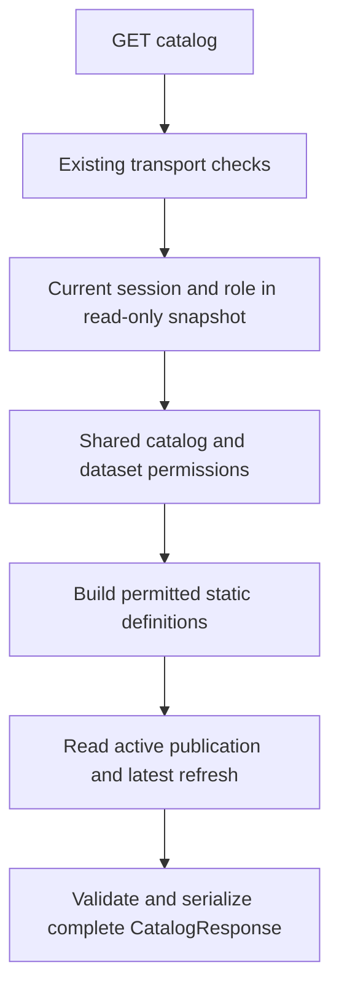

# Design: Catalog and permissions

Date: 2026-10-04
Status: Implemented October 4, 2026 under alayala's explicit implementation request. Offline and real PostgreSQL/HTTP evidence are recorded separately in the [implementation session](../../ai/sessions/2026-10-04-catalog-permissions-implementation.md). Alayala's retained-account Docker operator check passed with no active publication; see [operator evidence](../../ai/sessions/2026-10-04-catalog-docker-operator-check.md). Frontend checks remain pending.
Branch: `feat/catalog-permissions`
Basis: [proposal](proposal.md), approved [specification](spec.md), [tasks](tasks.md), [A15 backend structure](../../docs/backend.md), and [A16 catalog freshness refinement](../../DECISIONS.md#a16--approved-api-flow-and-detailed-contract).
Evidence: [design/tasks session](../../ai/sessions/2026-10-04-catalog-permissions-design-tasks.md).

## Human

### How the catalog works

Reuse local login and the existing dataset definitions. Add a small catalog feature that translates those definitions into readable metadata and combines them with publication and refresh information from PostgreSQL.

Input: an authenticated catalog request. Flow: check current identity and role → select allowed datasets → read one publication and the newest refresh attempt in the same database snapshot → return the closed API response. Output: Viewer gets national metadata; Analyst/Admin get all three datasets. No outage file is opened.

The dashboard can use Viewer metadata without showing a Catalog button. Frontend navigation remains later work. The backend checks permissions on every call, including direct API requests.

Failure example: a new refresh fails while an older publication is still active. The response keeps `data_ready=true`, identifies the older active publication, and reports only the newer refresh's status and times. If PostgreSQL cannot provide reliable state, return an error instead of an empty catalog.

### Implementation boundary

Add the catalog router, service, registry and response models already selected by A15. Add one safe refresh-summary read to the existing refresh repository. Reuse the current publication reader, transaction and error handling. No production dependency, migration, source-data fetch or analytical executor is needed.

Implementation follows [tasks.md](tasks.md). The sections below retain the reviewed design; the implementation and operator sessions distinguish automated results from the completed retained-account check.

## LLM

### 1. Baseline and ownership

Inspected `main.create_app` registers auth/settings plus health; catalog remains absent. `auth.dependencies.require_capability` resolves a verified principal and connection through `AuthService.authenticated`. `Database.transaction(..., readonly=True)` already uses repeatable-read isolation. `read_publication` validates the active pointer's joined version/run state. These are source observations, not new runtime checks.

| Location under `backend/` | Planned change and responsibility |
|---|---|
| `src/trinity/catalog/__init__.py` | Package marker without configuration or I/O. |
| `src/trinity/catalog/router.py` | One `GET /api/v1/catalog` route with `CatalogResponse`, using `require_capability("catalog:read")` and delegating to the service. |
| `src/trinity/catalog/service.py` | `get_catalog(principal, connection)` rechecks catalog capability, filters definitions, coordinates metadata reads and assembles one complete response. It uses the authenticated transaction's supplied connection. |
| `src/trinity/catalog/registry.py` | Ordered dataset presentation metadata and national metric definition; derive columns and daily keys from `contracts.datasets.DATASETS`. No role matrix or database access. |
| `src/trinity/catalog/schemas.py` | Closed catalog response models, field bounds, type mapping constraints and UTC wire serialization. Reuse existing `StrictModel`, `Publication` and `RunStatus` rather than duplicating their contracts. |
| `src/trinity/auth/permissions.py` | Expose the existing permitted internal dataset keys through one helper, `permitted_dataset_keys(principal)`. Make `require_dataset` delegate to it so selection and denial share one policy. Preserve all existing capabilities and error codes. |
| `src/trinity/refresh/repository.py` | Add `read_last_refresh(connection)` with an explicit three-field projection; keep Admin `read_context` unchanged. Return a row or None, without importing catalog models. |
| `src/trinity/main.py` | Register the new router. Keep existing application lifecycle, dependency injection and health behavior. |

No planned change to connector code, analytical schemas, S3 adapter, authentication storage or database migration history. `publication.repository.read_publication` remains the publication authority; catalog-specific invalid persisted-value handling belongs at the catalog boundary. Revisit a shared helper only if a focused implementation test proves it necessary, and document the reason.

Using existing auth response primitives follows current package conventions and avoids a broad shared-model relocation. This slice does not introduce a generic registry framework or another persistence abstraction.

### 2. Request and authorization flow



The existing authentication dependency owns entry/exit of the read-only transaction. `get_catalog` uses its connection and opens no second transaction or connection. This preserves service-owned transaction boundaries without moving feature logic into the router.

Call `require(principal, "catalog:read")` before catalog-state access. The planned `permitted_dataset_keys` helper returns internal keys in national/facility/generator order, using the existing role rule. `require_dataset` continues to emit `404 dataset_not_found` for unknown or unauthorized keys after capability checks. Unknown roles still fail through `capabilities`; this change adds no permissive default.

Use the returned allowed keys to request registry definitions. Do not iterate available registry entries and silently skip a missing permitted dataset. For example, a missing national definition is an internal error, not an empty Viewer response. Do not catch every permission exception as an instruction to omit an entry.

The route accepts no parameters or body. Retain `SafeTransport`'s current query-string/GET-body rejection and its position before authentication. Client fields cannot select a role, dataset, publication or storage path. The server principal is never constructed from request fields.

### 3. Static definitions and response models

The registry holds labels/descriptions and filter names for the three known internal keys. For each permitted key, derive `Dataset.key` from `DatasetDefinition.table_name`, `daily_key` from `key_fields`, and ordered columns from the Arrow schema. Reuse A9's schema; never open a Parquet file to infer metadata.

Map only the current schema types: Arrow Date32 → `date`, string → `string`, and the canonical decimal type → `decimal`. An unexpected type fails; there is no generic `str(type)` fallback. `nullable` comes from the Arrow field. Unit metadata maps `capacity`/`outage` to `MW`, `percentOutage` to `percent`, and identifiers/dates/labels to null. Test each current column against the canonical definitions and fail if presentation metadata is incomplete.

National filters are `start`/`end`; facility adds `facility`; generator adds `generator`. These are names only, without choices or sample rows. The exact matrix and column order are in the approved specification rather than redefined here.

The single metric describes `offline_share_percent`, the national `100 × outage / capacity` formula, `percent` unit, both canonical null reasons and two display decimal places. It is static text, not executable SQL or a value calculation. Keep `percentOutage` identified as a reported source field.

Define closed `Column`, `Dataset`, `MetricDefinition`, `LastRefresh`, `Freshness`, and `CatalogResponse` models. Use the OpenAPI field names, bounds and enumerations. Successful construction must also enforce the stronger slice invariants: exact expected role dataset set/order, exactly one metric and publication/freshness consistency. Do not add route-selected roles or capabilities to the response.

Do not return a mutable shared response object or cache a user's filtered output. Immutable source definitions may be shared; build fresh response containers per request. Required null fields remain present. UUIDs serialize as strings, dates as dates and timezone-aware timestamps as UTC strings ending in `Z`. Reject naive persisted timestamps rather than guessing a timezone. Verify nested publication serialization through actual HTTP JSON, not just Python objects.

### 4. Publication and refresh state

Call the existing `read_publication(connection)` once. Preserve its empty-pointer versus failed-join checks. Use the returned publication for `data_ready` and both publication-derived freshness dates; do not reread the pointer for those values.

Add this fixed, read-only statement inside `refresh.repository.read_last_refresh`:

```sql
SELECT status, requested_at, finished_at
FROM refresh_runs
ORDER BY run_seq DESC
LIMIT 1
```

The statement has no client-supplied input. `run_seq` is already positive, unique and indexed by the existing migration. No new index or migration is planned. Return None only when the query successfully returns no row. Do not use `SELECT *`, join candidates/approvals/warnings, call Admin `read_context`, or expose the sequence in the response.

Validate the projected row against canonical status and timestamp rules. Preserve the database's terminal-state rule: succeeded/failed/discarded/superseded runs have a finish time; requested/running/awaiting_approval/publishing/publication_failed runs do not. No inferred timestamps or retry-history aggregation is added.

Both reads use the same repeatable-read transaction as identity resolution. An update committed by another connection during the request is visible on the next request, not halfway through the current response. No row locks, publication writes or analytical reservations are needed for catalog reads.

Validate publication field types, timezone and the existing coverage invariant (`coverage_start <= latest_observation_date <= coverage_end`) before response assembly. Treat invalid persisted state as a dependency failure. Do not download the manifest to revalidate data or claim the catalog has proven stored object integrity.

### 5. Error boundaries and limits

| Boundary | Handling |
|---|---|
| Transport/session/capability rejection | Reuse the existing safe problem behavior before catalog reads; do not reorder combined-invalid-input errors. |
| Database read failure after successful authentication | `AuthService.authenticated` already maps propagated Psycopg errors to `503 dependency_unavailable`. Preserve its distinction from pre-authentication database/pool failures. |
| Malformed persisted publication/refresh values | In a small state-reading/validation boundary, translate known schema/value validation failures to `503 dependency_unavailable` without raw detail. Do not wrap registry or arbitrary application code in this mapping. |
| Missing static definition, unsupported Arrow type or invalid presentation metadata | Let the existing unexpected-error boundary return safe `500 internal_error`; never fabricate empty/fewer datasets. |
| Success or failure | Existing transport supplies no-store and request IDs; 401 retains its Bearer challenge. Verify body and captured logs do not expose private values. |

The existing pool has a four-connection per-process bound, bounded acquisition/database waits and the current operation budget. Reuse those controls. No retries or new timeout values are selected. A failure from existing transaction/deadline teardown remains a safe failure and must not become a successful partially sent response; test dependency cleanup ordering through the real route.

Do not add another catch-all that hides programming errors as database outages. Do not include raw request input in raised exceptions or logs. No new logger or global error-handler rewrite is planned. No catalog path uses query admission, engine memory limits, containers, Redis, EIA or S3.

### 6. Tests and operator evidence

| Planned location | Evidence |
|---|---|
| `backend/tests/test_catalog_unit.py` | Registry/schema derivation, shared permission behavior, complete real-route responses using controlled service/database doubles, state-error mapping, transport/header checks, no-I/O guards and canary rejection. |
| `backend/tests/test_catalog_postgres.py` | Opt-in tests using real sessions, current roles and migrated disposable PostgreSQL; publication/refresh snapshots and errors; a real loopback HTTP flow for all three personas. |
| `backend/tests/test_auth_unit.py`, `backend/tests/test_catalog_unit.py` | Existing auth regressions remain intact; the new catalog tests cover the extracted dataset-key helper and preserved denials. Shared database fixture methods were moved unchanged to `backend/tests/postgres_fixture.py`. |
| `backend/tests/run_local_auth_checks.py` | Extend its test selection to include catalog tests while preserving its disposable PostgreSQL 17.11 cluster, private socket, safe cleanup and existing auth acceptance. Keep the current command valid. |
| `backend/src/trinity/auth/check.py` | Add an optional `--catalog` check to the existing hidden-input persona command. Default auth-only behavior remains valid. With the flag, inspect the catalog's exact role keys/readiness consistency and check denial after logout without printing tokens or response bodies. |

Reuse test fixture builders where needed through a small test-only extraction; do not duplicate the whole auth harness or inherit its test class and rerun its tests as catalog tests. Keep fixture and reset actions inside the disposable test database, retain explicit refusal of non-test targets, and never seed a synthetic publication in a retained database. No new production dependency is required for schema checks; compare the response's actual field sets, types, bounds and values to the existing OpenAPI fixtures using the current test stack.

For races, synchronize two connections with explicit events/barriers around the state reads. Commit the competing publication/refresh update after the request snapshot exists, release the blocked read, then make a new request. Assert coherent old state in the first response and committed new state in the next. Avoid timing-dependent sleeps as the proof. Record whether the test uses TestClient or a real HTTP server.

For S20, make direct storage/analytical calls fail if invoked and assert catalog succeeds through PostgreSQL alone. Check permitted side effects separately: login/logout write auth state as part of test setup; the catalog request itself performs no application-state write. Test state projections for all roles, not only Viewer, since OpenAPI exposes the same safe freshness shape to everyone.

No backend test can prove a hidden frontend button. S24 remains in the future frontend work. A passing catalog suite also does not prove preview/SQL isolation or live publication correctness.

### 7. Delivery and review

Alayala subsequently authorized all implementation stages; the implementation evidence records their completion. Update backend setup to describe the new route, extended disposable runner and optional operator check only when they exist. Mark recorded checks accurately; PostgreSQL skips are pending checks, not passes. No commit, push, PR, migration or live cloud action is included in this planning request.

The branch shares a worktree where other work can change concurrently. Review current status and the exact slice diff before delivery; do not stage all modified files. Preserve prior decision/session history and append measured results to a unique implementation session when code work begins.
