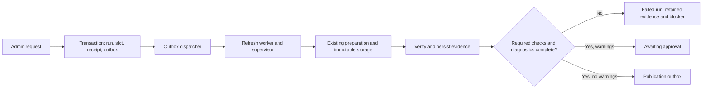

# Design: Build Refresh

Date: October 4, 2026. Status: **tasks 2–4 implemented; task 5 integration remains pending**.
Related: [spec](spec.md), [integration contract](integration-contract.md), [tasks](tasks.md).

## Human

PostgreSQL owns whether work is accepted and what it has completed. Redis carries
notifications to workers. Candidate files carry immutable evidence. Each has a
different role: losing a notification cannot erase the request, and a file cannot
grant itself permission to publish.

Publication outbox is the end of this slice. The separate publisher consumes it.

## LLM — ownership and existing code

| Module | Responsibility (see tasks for implemented scope) |
|---|---|
| `refresh/router.py`, `refresh/schemas.py` | Add canonical command and safe run/candidate reads; reuse public OpenAPI shapes, transport limits and permission names. |
| `refresh/evidence.py`, `refresh/registration.py` | Implemented initial saved-evidence loader and fenced successful-candidate registration. Preserve Preview field names and existing read behavior. |
| `refresh/service.py` | Preserve `admin_context`; add admission, claim/progress, evidence acceptance and full-refresh failure/recovery rules. Own each transaction. |
| `refresh/repository.py` | Parameterized persistence of runs, steps, candidates, artifacts, results, command receipts and full-refresh warnings. Helpers use caller connection; no hidden commit. |
| `publication/repository.py` | Preserve `read_publication`; only supply publication-intent persistence through the shared transaction if that responsibility is placed here. No activation logic in Refresh. |
| `adapters/queue.py`, `workers/outbox.py`, `workers/refresh.py`, `workers/recovery.py` | Selected A15 locations: bounded transport, committed-intent dispatch, trusted process entrypoint, durable unfinished-work reconciliation. Worker loops delegate rules to services. |
| `connector/prepare.py`, `connector/pipeline.py`, `connector/validate.py`, `connector/client.py` | Reuse existing stages, process timeout behavior and verifiers. Add the smallest internal adapter hooks for reserved IDs, durable attempts/progress and latest-national discovery; keep CLI behavior/formats compatible. |
| `contracts/manifest.py`, migrations and tests | Reuse canonical JSON and hash helpers. Implement approved integration migrations and meaningful contract/rollback/concurrency/process tests. |

`AuthService.authenticated` currently opens a read-only transaction. The new command
service must open a bounded writable transaction and reuse trusted session resolution
and capability checks inside it, rather than using the read route's connection.
Do not hold a database connection throughout preparation. Recheck current user/session
before command effects; worker authorization comes from accepted durable work, not a
stored bearer token. Later logout does not cancel accepted work.

## 1. Admission transaction

Input is only current session and validated empty command/key. Authenticate before
reading any command receipt. Lock `refresh_control` using the canonical order;
check for a prior authorized matching receipt before applying new-admission guards.
A matching replay returns the old acceptance, even if its run is now terminal.
Conflicting key use returns canonical conflict without exposing another resource.

For new intent, verify completed setup and no holder/unresolved warning. Read settings
consistently, freeze policy/revision, allocate run UUID and receipt operation UUID,
insert requested run (null end until discovery), reserve slot and insert refresh
outbox + command receipt. Unique keys and control lock arbitrate races. Receipt uses
the committed run ID and status URL. On commit failure, return safe 503 and no receipt.
Never enqueue from inside the route transaction or report a successful enqueue as 202.

Shared admission remains reusable for future scheduled/rerun callers, whose authority
and request identities differ. This slice adds no scheduler or rerun HTTP action.

## 2. Dispatch and restart

Payload v1: `schema_version`, `run_id`, nullable `version_id` before discovery,
`job_kind`, `dispatch_generation`, and `publication_generation` for publication work.
Worker reloads policy and paths from trusted state. Reject unsupported schema, wrong
kind, stale generation and inconsistent IDs before preparation. Queue IDs must encode
logical identity plus dispatch generation in a BullMQ-compatible format; confirm
the pinned library's identifier restrictions in the later adapter compatibility test.

Outbox claim transaction assigns a lease token/expiry and increments durable attempts.
Commit, enqueue outside transaction, then acknowledge only that token/generation.
Crash after enqueue permits duplicate delivery. A repaired dispatch generation must
not be suppressed by an old retained queue job. Never equate queue job retention or
`delivered_at` with execution success.

Proposed bounded dispatch round: three enqueue attempts with 1/3-second waits and
10 seconds per network call within a 40-second round. Lease 60 seconds, heartbeat
10 seconds. Persist counts before attempts. On exhausted initial-refresh dispatch,
record failed run + unresolved warning under fence/control checks unless a worker
has already claimed; recovery must reconcile the claim first. PostgreSQL outage
retains durable pending work for later reconciliation rather than fabricating failure.
Publication-intent dispatch/failure accounting is shared with the future publisher;
do not run a publication consumer or exhaust its obligations in this slice's tests.

## 3. Worker and bounded preparation

Claim only a requested run/current refresh job (or an explicitly safe recovery path).
Advance execution fence, lease, run revision and start time in a short transaction.
Allocate the version once after bounds freeze; keep it across safe receipt import.
Use a durable worker directory keyed by that version, not a user-selected path.
Persist supervisor ownership and retained evidence references before launching child work.
At version creation, initialize required `latest_observation_date` from the measured
national discovery date. This is source discovery evidence, not validated candidate
coverage. Before readiness, require the saved national Parquet maximum to agree;
never populate this field from the current clock.

Newest-national discovery is a new connector capability, not an existing CLI option.
Use the fixed national route with descending period and bounded response, validate
the date, retain sanitized discovery evidence, and durably freeze the end before
preparation. Verify the actual request/response contract against official EIA sources
and synthetic transport fixtures during implementation; this design makes no live
endpoint claim. If discovery occurs but its transaction does not commit, no window
was frozen and a bounded rediscovery is permissible; never change a committed end.

### Worker settings implemented under A23

| Limit | Proposed initial value and reason |
|---|---|
| Discovery | 60 seconds total, max three temporary external attempts within it. |
| Preparation | Preserve CLI defaults: each route 300 seconds, freeze 120, validation 120, storage 300; whole preparation 1,440 seconds. Preserve existing 64 MiB per-object limit. |
| Registration and complete refresh execution | 30 seconds to verify/import once remote preparation proof is available; 1,530 seconds total execution including discovery/preparation/registration, persisted deadline survives recovery. Additional remote rechecks must fit remaining budget or fail, never reset it. |
| Worker lease / heartbeat / recovery poll | 30 seconds / 5 seconds / 10 seconds; one authorized full-refresh worker. Lease loss stops child work; fence rejects late writes. |
| Child stop | Existing 5-second terminate grace, then kill and confirm exit. If exit cannot be established, keep slot and do not start replacement. |

These initial engineering settings were implemented under [A23](../../DECISIONS.md#a23--durable-refresh-dispatch-and-one-fenced-preparation-execution). They are not measured full-history guarantees. Migration must add `refresh_runs.execution_deadline_at` of type
`timestamptz` (null before first claim, set once on first execution) and
`refresh_steps.deadline_at timestamptz` (null before step start), so a crash cannot
reset budgets. Add `refresh_runs.worker_owner_id uuid` and `worker_execution_ref jsonb`
for trusted supervisor instance/process identity (no secrets); an execution
reference must include enough process-start identity to avoid treating a reused PID
as the old child. These complement the evidence columns in the integration contract.
Do not expose them in API responses. Exact supervisor liveness/termination protocol
must pass S15 before enabling automatic reclaim across worker hosts.

Do not wrap the whole connector in another automatic retry loop. Existing connector
temporary retries already consume the external-operation budget. Persist attempt
accounting before reissuing an external operation; if the old operation's accounting
cannot be established after crash, do not replay it. This proposal permits **one
fresh pipeline execution per run**; safe recovery resumes dispatch or imports a
completed receipt, not extraction into an existing root. A killed incomplete pipeline
ends failed after stop confirmation and requires the later Admin rerun action.
This is a finite full-refresh recovery policy, not a CLI resume implementation.

## 4. Progress and evidence import

Use the integration contract's stage names, mappings and exact identity checks.
Durable database step creation precedes execution. The supervisor persists local
stage events before acknowledgment; import partial journals after a stopped child.
Persist result rows incrementally or replay them from the journal under the current
fence; unique step/check/scope identity makes repeated import harmless only when
stored fields match. Keep terminal attempt results immutable.

Register `validation_attempt_id` from the validator's durable start event. An internal
validation-start hook is needed to bind it promptly; the existing stage callback
does not contain that UUID. Validation details remain source-preserving and protected.
When persistence fails, stop/retain work rather than continuing untracked external
operations. After storage succeeds, verify complete receipt/evidence before the short
atomic readiness/outbox transition. Database timestamps describe actual stage/acceptance
events; they must not assert remote completion that has no evidence.

Failure import handles absence explicitly: no discovered window → no version; a
reserved version without a manifest → rejected candidate with null manifest; a
partial validation → retain actual rows and failed/abandoned validation step, never
invent missing outcomes. Operational storage failure can leave locally passing
checks but no accepted stored candidate. Proposed conservative status is `rejected`
for publication readiness while preserving all passing rows; rerun uses a new run.
In all cases, keep prior publication and one unresolved operational failure warning.

## 5. Read surface and slice boundary

Use canonical Admin projections for run history/detail and candidate detail. Cursor
design must bind purpose, identity, page size, snapshot maximum sequence and last
sequence; reuse any existing project cursor mechanism if one exists at implementation
time, otherwise select and test a bounded authenticated format before coding reads.
No raw source records, S3 keys, SDK messages or local paths enter public diagnostics.

The code may report canonical eligible actions whose endpoints belong to later slices;
do not claim those commands are implemented. No deployment/user walkthrough should
enable this unfinished flow without setup writes and required recovery/review/publisher
capabilities. Tests can inspect persisted handoff with isolated fixtures. Never mark
a run succeeded merely to release the slot or complete a test.

## Review dependencies

Review integration evidence columns, worker deadline/ownership additions, conservative
one-pipeline recovery and proposed budgets together. Before implementation, reconcile
accepted details into the canonical schema and decision record. Before live use,
verify pinned queue APIs and EIA discovery behavior, full-history capacity, durable
worker storage and process-stop evidence. No external service or runtime proof was
performed while drafting this design.

## Task 3–4 implementation refinements

[A23](../../DECISIONS.md#a23--durable-refresh-dispatch-and-one-fenced-preparation-execution)
and the [measured continuation](../../ai/sessions/2026-10-04-refresh-dispatch-and-worker.md)
supersede draft status above for admission, dispatch and preparation. Three durable
dispatch attempts span process restarts and generation repairs; calls are capped at
ten seconds, with one/three-second due times and sixty-second crash leases. The
earlier forty-second uninterrupted-round estimate is not a wall-clock guarantee
across a crash or unavailable PostgreSQL. No lease heartbeat is needed around a
single ten-second enqueue inside a sixty-second claim.

Local supervisor and child hold shared lifetime locks. Recovery requires the recorded
host/inode and exclusive lock ownership; PID alone is informational. Unknown ownership
retains admission, and no recovery path restarts extraction. Stage/result and external
attempt custody precede acknowledgment. Successful preparation retains its original
receipt hash for task 5, which still owns final verification/routing and completed
receipt recovery. Failure import is implemented without readiness.
