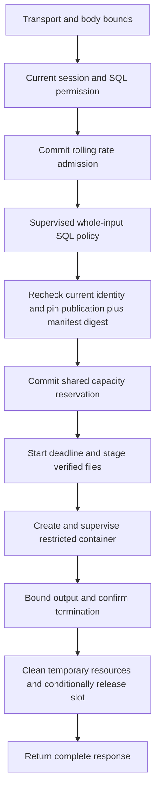

# Design: One-table read-only SQL

Date: 2026-10-04
Status: Approved design with bounded pair-programming preparation completed. Stop before core validation; no HTTP implementation is authorized by the current request.
Branch/base: `feat/catalog-permissions`, `fde733b`. Preserve existing catalog and API Docker work.
Basis: approved [specification](spec.md), [proposal](proposal.md), [tasks](tasks.md), A16/A19 refinements in [DECISIONS.md](../../DECISIONS.md), and [A15 architecture](../../docs/backend.md).
Evidence: [design/tasks session](../../ai/sessions/2026-10-04-single-table-sql-design-tasks.md).

## Human

**Pairing boundary:** the latest user instruction reserves core-validator implementation for alayala or paired work after case review. Only AST/API inspection and minimum test preparation are complete; see [pairing-gate.md](pairing-gate.md). DataFusion compatibility infrastructure follows only after a working validator and human review of its security-sensitive execution path. The later stages below remain a design, not permission to execute them now.

### Input, work and result

An Analyst or Admin sends one SQL string through their current session. The API checks permissions, counts the request, validates all SQL, and pins a published version. A trusted supervisor reserves capacity, downloads only the required files, checks them, and starts one restricted DataFusion container. It returns bounded results only after confirming that execution ended.

Viewer sees no SQL button, menu, editor or Run control. Opening a SQL URL returns Viewer to the waiting screen or national dashboard. A direct SQL request receives a backend denial before SQL parsing, rate accounting, capacity reservation or file access. The later frontend must prove the visual/navigation rule; this backend slice proves the API rule.

Example: a query for ten national dates returns at most ten ordered rows and the identity of the publication used. A concurrent refresh cannot mix newer files into those results.

Failure example: the browser disconnects while DataFusion is running. The supervisor stops the container and confirms termination. Until that confirmation, its capacity slot stays occupied. A stopped API process does not make its old query disappear or authorize a replacement query.

### Implementation order

Follow the five stages in [tasks.md](tasks.md): maintain evidence; verify SQL/engine compatibility; add trusted state and file preparation; add supervised isolation; connect and verify the endpoint. The endpoint is the final integration step. No live publication or cloud configuration change is needed to prove the local slice with disposable fixtures.

This design reuses the selected Python dependencies. It proposes concrete runtime settings below, subject to measured compatibility and isolation checks. Library signatures and documentation are evidence of available interfaces, not proof that Trinity enforces the intended behavior.

## LLM

### 1. Baseline and module ownership

Current `AuthService.authenticated` holds a repeatable-read transaction through the dependency yield. `Database.transaction` uses a 15-second default Deadline and five-second database bounds; Deadline expiration currently maps to auth_unavailable. Do not wrap a 30-second query in this existing request-wide context or reuse that error mapping for analytical timeouts.

`read_publication` returns public metadata, and `data_versions` already contains its frozen manifest SHA-256. Existing connector storage uses the server-configured version root and `manifest.json`; `read_manifest` validates the frozen structure. This permits a pinned manifest read without implementing publication writes or inventing client-selected paths.

The uncommitted `backend/Dockerfile`, entrypoint and Compose API service contain database setup/credentials at runtime. They are an API deployment, not the query image. This planning turn does not modify them. Docker CLI was not found in the agent PATH; no daemon, image or container acceptance was performed.

| Location under `backend/` | Planned responsibility |
|---|---|
| `src/trinity/queries/router.py`, `schemas.py` | Closed SQL request/response models and one route; reuse transport, bearer extraction, Problem and public column/publication primitives. |
| `src/trinity/queries/service.py` | Current identity, capability, short snapshots, rate admission, policy result, publication pin and final response composition. No direct engine execution. |
| `src/trinity/queries/repository.py` | Supplied-connection rate and reservation queries, conditional ownership changes, and safe persisted lifecycle projections. No independently owned transactions. |
| `src/trinity/queries/client.py` | Trusted supervisor: deadline, download staging, create/start/output/stop, resource cleanup and recovery coordination. Never initialize inside the query container. |
| `src/trinity/queries/runtime/sql_policy.py` | One SQLGlot policy plus deterministic trusted normalization used before downloads and inside the runtime. Pure input/output; no auth, database, S3 or Docker imports. |
| `src/trinity/queries/runtime/engine.py`, `main.py` | Restricted DataFusion context, authorized file registration, bounded batch/result serialization, and fixed isolated entrypoint. |
| `src/trinity/contracts/queries.py` | Closed, versioned JSON messages and small immutable policy/snapshot/result objects. No pickle and no privileged initialization. |
| `src/trinity/publication/repository.py`, `adapters/s3.py` | Extend trusted read-only publication binding and bounded read/stage operations. Preserve existing candidate-write behavior and tests. |
| `src/trinity/adapters/docker.py` | Narrow local Docker Engine transport for trusted configuration and known container identities. No client-defined commands, images, mounts or daemon endpoints. |
| `src/trinity/workers/recovery.py` | Dedicated query-recovery entry mode, delegating to the supervisor. It does not implement BullMQ or refresh recovery in this slice. |
| Next Alembic revision; `Dockerfile.query`; focused tests | Rate/reservation persistence, query-only image, and the acceptance evidence below. Select the next migration ID after rechecking concurrent changes. |

Reuse `auth.permissions.require` and canonical `DATASETS`; do not add another role/schema registry. Extend auth with a small callback/snapshot entry only if necessary to close its transaction before analytical work. Existing catalog/settings dependencies must retain their behavior.

### 2. Request flow and short transactions

Use a query-specific service entry receiving the opaque token, not a dependency that keeps a connection open. Token lifetime in memory ends after the last identity read; never pass it to the policy child or query container.

1. In a short read-only auth transaction, resolve current identity and require sql:execute. Close it before starting the policy child. Viewer cannot reach analytical accounting.
2. In a short write transaction, reserve D02's rate attempt and commit it. If denied, return 429 after transaction exit. Later SQL/no-publication/capacity failures do not roll this debit back.
3. Run the bounded policy child with the canonical permitted schema projection. Any SQL failure returns before manifest or Parquet download.
4. Open a fresh read-only snapshot, re-resolve the same session/user, require SQL capability again, and capture publication metadata plus validated version/run state and frozen manifest digest. An observed downgrade/expiry stops here; already-counted attempts stay counted. Successful second authorization is the accepted-work boundary. Close this snapshot before reservation/staging.
5. Reserve capacity in a separate short write transaction using that immutable snapshot. A later publication change does not change this request's authority. Repositories do not reread the active pointer during execution.

This intentionally uses two current-identity checks: the first protects parsing/accounting; the second binds accepted work and publication coherently. It does not promise that identity cannot change immediately after authorization. Preserve A19's permission for already-authorized accepted work to finish.

Reuse database statement/lock/acquisition bounds, but make the deadline/error code explicit for each boundary. Auth read failure remains auth_unavailable; later metadata/admission failure is dependency_unavailable. Analytical expiry is query_timeout. Add the smallest deadline abstraction change needed to express this without changing existing auth defaults. A transaction failure during entry/exit never becomes a successful response.

### 3. Whole-input policy and compatibility gate

Use SQLGlot 30.21.0 with explicit PostgreSQL read/write dialect for the D01 subset, `ErrorLevel.IMMEDIATE`, `max_errors=1` and `max_nodes=4096`. These are design settings to verify, not a claim of PostgreSQL engine compatibility. Use `parse`, not `parse_one`, and require exactly one nonempty statement. Token checks distinguish a permitted terminal semicolon from extra empty/multiple statements and reject hints/unsupported literal spelling before normalization erases it.

Policy work runs in a short-lived spawned Python process with a cleared allowlisted environment, closed inherited file descriptors and no database/storage handles. Its module imports only the policy/message code and SQLGlot. Initial bounds: 16 KiB text, 4,096 tokens/nodes, AST depth 64, two-second wall deadline including child startup, and two policy children per API process with no unbounded queue. The supervisor kills and joins an expired child; no Python thread timeout is treated as termination. Measure startup and memory on the supported runtime before retaining these settings. Bound recursion before/while parsing and handle RecursionError safely; max_nodes alone is insufficient.

Walk all nodes and all nonempty arguments. The allowlist must constrain argument forms, not just class names. The first implementation creates a reviewed class/argument table from the installed version for D01's Select/From/Table/alias/identifier/column/star/literal/date, clauses, arithmetic/comparison/boolean, IN/BETWEEN, CASE and eight function forms. Unknown nodes/arguments fail. The DATE literal exception must be token-and-shape checked; a generic Cast node is not permission for CAST. Strip comments only after validation. Do not use optimizer rewrites that can introduce hidden physical references.

Resolve exact canonical identifiers before generation. Quote all canonical table/column/alias references in generated engine SQL. Reject schema/catalog qualifiers, duplicate table aliases, unknown columns and ambiguous output-alias references. Map public names to internal keys using DATASETS. Treat a self-join, any second table reference, table function or nested SELECT as disallowed even if the table name is permitted.

Generate private unique output names such as `__trinity_c000` for engine projections, with a separate ordered public-label mapping. This avoids relying on an engine accepting duplicate projection labels. Direct columns retain their source name unless explicitly aliased; other unaliased expressions receive `expression_1`, `expression_2`, etc. Preserve explicit duplicate public labels. Resolve ORDER BY output aliases before replacing private aliases; reject ambiguity rather than guess. Expand stars from canonical column order. Force D03's explicit direction/null ordering in generated SQL. Round-trip the generated operation through the same policy in an internal mode that permits only these trusted projection names; compare table, expressions and mappings. Never blindly accept a second arbitrary SQL string from a caller.

The policy result contains policy version, canonical dataset/table, normalized operation, output labels/units and a digest of the canonical internal message. It carries no storage authority. The runtime recomputes the validation/mapping digest and accepts only the one supplied local table mapping. It uses the same module; no second regex policy or alternate function registry is introduced.

**Compatibility gate before state/container work:** run the D01 fixture matrix with real temporary typed Parquet and the pinned engine. Record decimal result types/scales, ROUND tie/negative-scale behavior, overflow/zero division, CASE coercion, empty aggregates, mixed-case identifiers, comments, duplicate labels and binary/null ordering. ROUND's supported scale range and arithmetic precision must be fixed from these results in the design evidence before implementation proceeds beyond the gate. A permitted expression producing float/lossy or incompatible semantics is a blocking compatibility conflict, not permission to silently remove it, add functions/UDFs, change dependency pins or claim the entire grammar works.

Installed-source inspection confirmed SQLGlot's parser accepts max_nodes and DataFusion exposes the controls in the next section. No SQL fixtures or engine calculations ran during this drafting turn. [SQLGlot parser reference](https://sqlglot.com/sqlglot/parser.html) explains its parse/error interfaces; it is not a Trinity policy implementation.

### 4. DataFusion runtime and exact output

Create a fresh SessionContext for each query. Set `SQLOptions().with_allow_ddl(False).with_allow_dml(False).with_allow_statements(False)` on the SQL call; do not rely on defaults. Disable information_schema, register no external store/UDF/catalog provider, and register one local Parquet directory containing only the selected manifest files with the explicit canonical Arrow schema. Do not supply user-controlled paths, SQL parameters or named string substitutions.

Design configuration: PostgreSQL SQL parser dialect, `parse_float_as_decimal=true`, identifier normalization disabled, and ANSI error behavior where the pinned version supports and verifies it. Quote canonical identifiers regardless. Use a 768 MiB greedy engine memory pool with disk spill disabled inside the 1 GiB container. The container ceiling covers allocations outside the engine pool; neither setting is substituted for the other. Configuration failure prevents execution.

The installed Python package exposes these SessionContext, SQLOptions and RuntimeEnvBuilder interfaces. Official documentation describes statement controls, memory pools and disk-manager settings. [DataFusion context reference](https://datafusion.apache.org/python/autoapi/datafusion/context/index.html) and [configuration reference](https://datafusion.apache.org/user-guide/configs.html). Exact option availability/error semantics and numerical compatibility still need pinned-version tests; no successful context execution is claimed here.

Plan the validated operation, inspect output schema, and apply a DataFrame output limit of 1,001 after the user's query, preserving its LIMIT. Use bounded record-batch streaming rather than collecting all rows. Discard the sentinel row from output and set truncated only when it exists. The limit must wrap the final query result, never replace a table/input scan limit. Null/count/aggregate semantics and sorting still operate on all qualifying input rows.

Map supported Arrow scalars to OpenAPI types, including equivalent string representations exposed by the engine. Serialize integer and Decimal values directly as strings; never pass through float or connector canonical_json's fixed six-place conversion. Reject nonfinite/nested/binary/unsupported results and labels outside 1–128 characters. Validate every row length/type/nullability. Restore public labels by position; direct canonical columns retain MW/percent units and calculated expressions have null units under D03.

Build bounded public result fragments, then validate the final envelope with pinned publication and elapsed milliseconds in trusted code. Limit the whole encoded response to 5 MiB and 128 columns before successful headers. Preserve nulls/duplicates and reject partial JSON, duplicate keys or malformed runtime messages. Internal success payload gets a 6 MiB ceiling to allow protocol overhead; stderr is drained only up to 8 KiB and discarded, never logged raw. At either overrun, terminate and fail safely. Runtime errors contain only fixed codes, never engine text.

This slice introduces no new query diagnostics: return `diagnostics=[]` because the operation produces none. That array is not evidence that a published dataset has no source/validation warnings. Do not fetch unbound diagnostics files, rerun source validation, or fabricate Dxx records. If canonical-contract review requires publication diagnostics on every SQL result, resolve their immutable provenance and projection before endpoint enablement rather than silently treating unavailable evidence as warning-free.

### 5. Published manifest, storage and staging

Extend the trusted publication reader to return an internal pinned object with the public Publication plus `manifest_sha256` and contract version from the same snapshot. Verify validated/active version and succeeded run as today, and nonnull well-formed frozen digest. This internal object is never the public response. Existing catalog reads retain their smaller interface and behavior.

Download the fixed `manifest.json` under the server-configured bucket/prefix and pinned version UUID. Verify its exact bytes against the DB digest before `read_manifest`; require matching version/contract/coverage. The frozen manifest, not an arbitrary S3 listing, determines each selected data file. No new artifact table is needed for this read path; A9's broader publication persistence remains separate work.

Use a new bounded read/stage operation alongside existing S3 candidate-write operations. Query configuration permits GET only on application-owned published-object roots; supply an operator-configured read identity. Reusing the write-capable preparation identity is not evidence of permission separation. Do not change IAM or request credentials in implementation. Three-attempt temporary-error classification and original deadline remain shared policy.

Stream selected objects into exclusive no-follow temporary files, verify actual byte count/SHA-256 and canonical Parquet schema, then atomically seal them for the request. Require every selected manifest entry, not the first file or a partial successful set. Map original paths to generated local names `data/part-000000.parquet`; source storage paths never enter engine SQL. Treat mismatch as dependency_unavailable and do not launch. Initial staging safeguards: 4 MiB manifest, 1,024 selected files, existing 64 MiB per-object bound, 512 MiB total staged data per active request. These are proposed resource settings to measure; capacity exhaustion is query_resource_limit, not silent file omission.

Use a dedicated named staging volume mounted in the trusted API at a fixed path. Each request gets a UUID directory containing only its closed operation JSON and its selected data subdirectory. Restrict parent permissions and make files readable only as required by the query UID. The query receives only that request subdirectory through Docker's read-only volume-subpath mount; mounting the full shared staging root is forbidden. Verify subpath support on the actual daemon and inspect the resolved mount before start. This avoids confusing API-container paths with daemon-host bind paths, especially on Docker Desktop. No credentials, manifest for unrelated tables or sibling request data go into the mount.

### 6. PostgreSQL rate and capacity state

Add one forward Alembic revision, rechecking the next ID first. Proposed query-only persistence:

| Table | Fields and invariants |
|---|---|
| `analytical_rate_limits` | user_id FK/PK, ordered admitted-at timestamptz array bounded to 30 entries, last authoritative time. No SQL, token or body. Serial row lock; expire entries outside `(T-60s,T]` and append at most once. Use database time clamped to the row's previous time to avoid granting capacity on clock regression. |
| `query_admission` | Bootstrap singleton id=1 used as the shared short transaction lock for active-slot counts/inserts. Missing row is dependency failure. |
| `query_reservations` | request_id PK, user_id FK, pinned publication/version/digest, deployment_id, daemon_id, owner token/generation, lifecycle state, generated container name, nullable immutable container_id, start intent, heartbeat/deadline, timestamps, safe outcome, cleanup status. No SQL, token or credentials. Index nonreleased records and user_id. |

Service-owned write transactions lock the admission singleton, count every unreleased reservation and insert only below both limits. Rate admission is a separate committed transaction under the per-user row lock. Denied rate attempts do not extend the array; later failures do not roll back an admitted entry. Helpers return deny/accept data; raise public denial after successful transaction exit to preserve intended accounting. Current auth login counters remain unchanged.

Use database-time window boundaries and atomic row updates across processes. Avoid an in-memory semaphore as the global query guard. Keep the 30-entry rate state bounded; remove obsolete user rows only through trusted bounded maintenance. Polling/auth/catalog metadata do not increment this analytical counter.

Reservation states: `reserved → staging → creating → created → starting → running → stopping → cleaning → released`, with failure/recovery able to move any occupied state toward stopping/cleaning. A released record retains safe outcome metadata and cannot start again. Capacity counts all states except released. Heartbeats and deadlines guide recovery, not permission to release. Token/generation conditions prevent one owner from releasing or mutating another's reservation.

### 7. Docker transport, launch and recovery

Use the existing HTTPX dependency for bounded management calls over an explicitly configured local Unix Docker socket. Do not add the Docker Python SDK. The trusted supervisor owns daemon access; the query container never receives it. Implement only version/inspect/create/attach/start/wait/kill/remove/list-by-owned-label operations. No generic Docker proxy, caller-controlled daemon URL or arbitrary launch arguments.

Negotiate a tested Engine API version within 1.47–1.56; refuse unsupported daemon minima/features. Attach uses the documented non-TTY stdout/stderr stream. The narrow adapter must handle its HTTP upgrade/raw stream and eight-byte frame headers with bounded standard-library Unix-socket reads where HTTPX cannot expose the upgrade; no websocket or new network package is required. Do not assume HTTPX response iteration handles a 101 upgrade. Fixture and real-daemon tests must cover partial headers, huge frames, EOF and cancellation. [Docker Engine API](https://docs.docker.com/reference/api/engine/) documents the lifecycle interface; [attach reference](https://docs.docker.com/reference/cli/docker/container/attach/) describes output attachment.

Send the operation through a private read-only `request.json` in the request mount, not command-line arguments, Docker labels, environment or logs. Use fixed argv `python -m trinity.queries.runtime` (with a minimal `__main__.py` delegating to main) and fixed input location. Attach before starting, disable persistent container logging, and never request a TTY or interactive stdin. Container stdout contains only the bounded closed result. Docker transport stderr/raw errors are not passed to HTTP or logs.

Build a separate `backend/Dockerfile.query` using the existing CPython 3.14.8 base and locked environment, with no API entrypoint, migration step, secret mounts or default DB variables. Reuse the lockfile; do not install a second unpinned dependency set. Resolve the locally built image to immutable image ID during operator startup; reserve that identity in supervisor configuration. No request-time pull/build or fallback to another image. Additional installed packages in the lock are not authority to initialize privileged clients.

| Launch control | Proposed fixed value/behavior |
|---|---|
| Identity and privilege | UID/GID 10001, all capabilities dropped, no-new-privileges, Docker default seccomp enabled; no privileged mode, devices, host namespaces or Docker socket. |
| Network and files | NetworkMode=none; read-only root filesystem; read-only request subpath only; private 32 MiB tmpfs at /tmp with nodev/nosuid/noexec. No database/S3/API secrets. |
| Resource bounds | Memory=MemorySwap=1,073,741,824; one CPU, PidsLimit=64; no restart policy; no OOM-kill disabling. Engine memory is independently bounded. |
| Environment and command | Explicit minimal Python/PATH settings only; fixed entrypoint and request path. No environment inheritance. |
| Lifecycle | AutoRemove=false until supervision records stopped state and cleanup; logging driver none; deterministic deployment/request name plus owned labels; image ID fixed before serving queries. |

These controls are design requirements to test, not a sandbox proof. Docker documents memory/swap controls and runtime privilege settings. [Resource constraints](https://docs.docker.com/engine/containers/resource_constraints/) and [container run reference](https://docs.docker.com/engine/containers/run/). Query isolation must hold on the actual local platform without weakening settings to pass a build.

**Create/start fencing:** commit the reservation/name before create. Persist immutable container ID and a conditional start-intent record before any start call; there is no combined create-and-run operation. Recheck owner/generation at that transition. A late create after revocation can leave a stopped container but cannot gain a start grant. Never retry an ambiguous start by creating another container. Recovery first revokes future start grants, then acts on the recorded ID/name and ownership labels. Unknown create/start state retains capacity until absence of possible execution is proven.

A stale start may already be in flight when ownership changes. Recovery must stop and remove the known immutable container ID before releasing that reservation, so a delayed start cannot revive the same execution. Do not treat an early not-found by generated name as proof while creation is ambiguous. Verify create/start/inspect/removal ordering with controlled daemon races; retain the slot on any unresolved outcome. Duplicate recovery uses conditional DB ownership and idempotent observed Docker state, never blanket container removal.

Normal completion requires bounded output, exit code/status and matching request/publication/policy identities. Deadline, disconnect, excess output and shutdown trigger stop: request termination, allow at most one second grace, then kill and inspect. Management calls have individual bounded waits (initial two seconds each); failures do not restart the analytical deadline. HTTP may return a safe timeout while recovery continues, but the slot remains occupied. No success is emitted with unknown termination or unverified output.

Run a dedicated recovery process in local Compose, using the same trusted package, DB access, staging volume and daemon socket, with no public port. Store a database-time deadline for recovery and a local monotonic deadline for active supervision; never compare persisted monotonic timestamps across hosts/process lifetimes. It reconciles at startup and every five seconds. Stale heartbeats trigger ownership investigation after ten seconds; never infer death solely from elapsed time. Recovery resolves containers and abandoned staging, then conditionally releases. Lost DB/daemon access retains occupied state. Before enabling the route, prove API kill/restart with this process still running and recovery-process restart too. This is query recovery only; do not implement unrelated refresh/outbox behavior.

Resource cleanup removes only matching deployment/request temporary containers/directories after termination. Verify real file ownership and reject symlink traversal during cleanup. No prune command, volume deletion, published S3 deletion or arbitrary host path cleanup. A cleanup failure stays occupied in this conservative first design and is retried by recovery with a safe recorded code. Startup and periodic reconciliation must also find owned stopped containers whose late create response arrived after a canceled reservation; never start them or infer authority from a name alone.

### 8. Wiring, verification and handoff

Add the query route only after the preceding policy, state and isolation gates pass. Extend application lifecycle to initialize trusted query configuration and start its supervisor interfaces lazily. Health/auth/catalog must not require Docker/S3 access; query readiness/configuration failures return safe dependency errors on the SQL route. The recovery process must be operational before execution is enabled. Preserve the exact route inventory test when registration finally occurs.

Tests remain in `backend/tests/`: focused `test_sql_policy.py` / `test_query_engine.py`, `test_query_state_postgres.py`, `test_query_staging.py`, `test_query_supervisor.py`, `test_queries_http.py`, and opt-in `test_query_containers.py`. Reuse `postgres_fixture.py` for disposable identity/state and add query fixtures without inheriting and rerunning unrelated tests. Build synthetic immutable Parquet/manifest publications only in disposable state. Never turn stored live candidates into active publications to satisfy a test.

Run the smallest relevant unittest suite first. Opt-in database/container skips must be reported as unperformed, not passed. Mocked Docker calls prove command ordering, not isolation. A real DataFusion temporary-Parquet test proves engine behavior, not protected HTTP execution. Final acceptance requires real PostgreSQL + HTTP + query containers, cross-process rate/slot races, orphan/stop recovery, output bounds, no-network/no-secret/no-other-files checks and regressions. Cover S01–S28 and the API part of S29; its UI portion remains later frontend work.

Document the operator's build/start/check steps only after runnable artifacts exist. Alayala owns builds/clicks and retained-account evaluation; do not launch them merely because this design mentions Docker. Share one small operator action at a time. No commit, push, PR, live S3/EIA action or migration of a retained database is authorized by this design/tasks request.

Open implementation gates are concrete: pinned SQL numeric/grammar compatibility, Docker/socket/API/subpath availability, image build/isolation, read-only storage identity and authoritative live publication availability. They do not block drafting this design. Do not mark the slice delivered until required automated evidence exists; distinguish local synthetic acceptance from live/operator proof.
